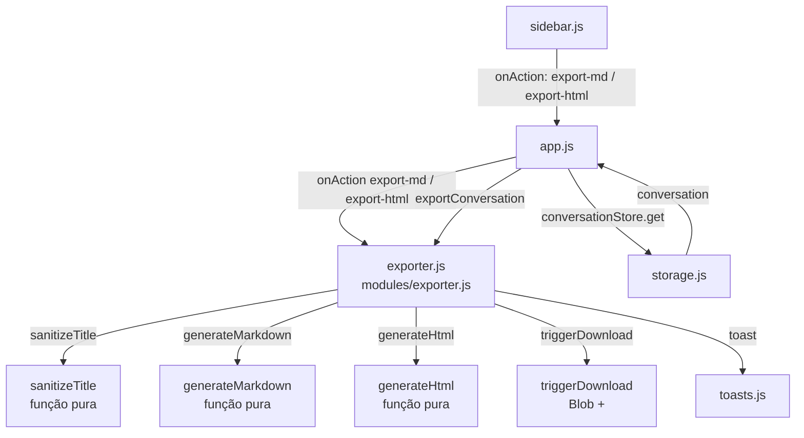
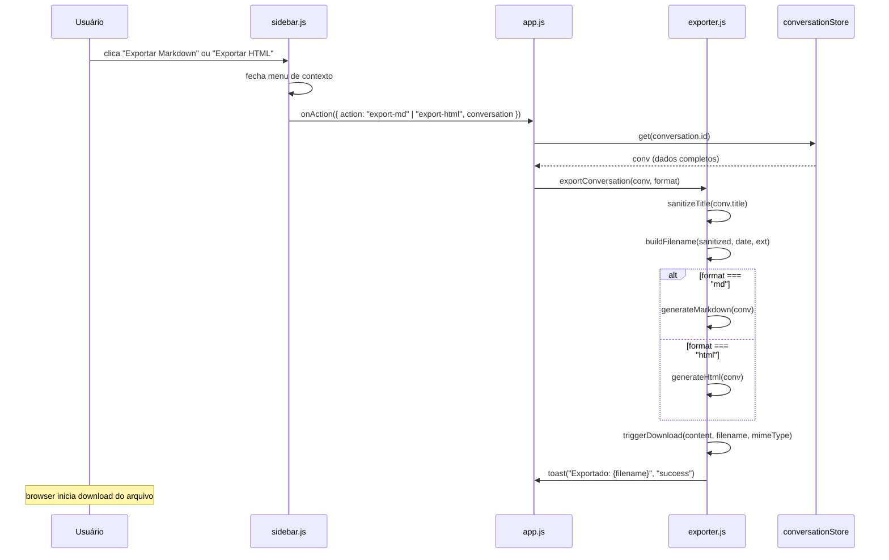
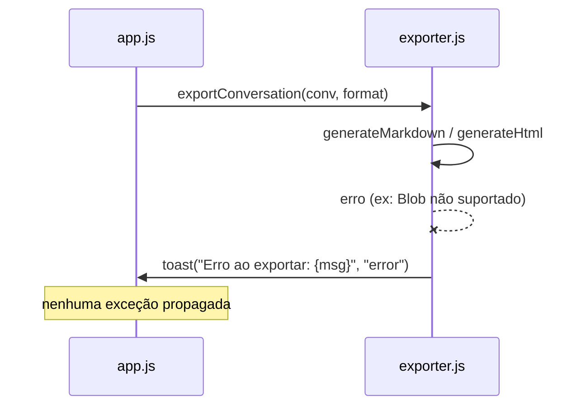

# Design Técnico — Exportação de Conversas

## Visão Geral

Esta feature adiciona exportação de conversas nos formatos **Markdown** e **HTML** ao Offline AI Chat. Todo o processamento ocorre no browser — nenhuma requisição de rede é feita durante a exportação. O arquivo é entregue ao usuário via download nativo (`Blob` + `URL.createObjectURL` + `<a download>`).

O ponto de entrada é o menu de contexto de cada conversa na sidebar (`modules/ui/sidebar.js`), que já possui as entradas "Exportar JSON" e "Exportar Markdown". Esta feature:

1. Cria o módulo `modules/exporter.js` com toda a lógica de geração de conteúdo e download.
2. Adiciona a entrada "Exportar HTML" ao menu de contexto da sidebar.
3. Formaliza e corrige o comportamento de "Exportar Markdown" existente (que hoje é tratado em `app.js` de forma ad-hoc).
4. Adiciona feedback via toast ao concluir ou falhar a exportação.

### Escopo

- Novo módulo `modules/exporter.js` com funções puras exportadas para testabilidade.
- Modificação em `modules/ui/sidebar.js`: adicionar "Exportar HTML" ao menu e delegar ambas as exportações ao `exporter.js`.
- Modificação em `app.js`: importar e inicializar o exporter, conectar ao handler `onAction` da sidebar.
- Nenhuma mudança em `modules/schema.js`, `localStorage` ou `IndexedDB` — a feature é puramente de leitura e geração de arquivo.

---

## Arquitetura

### Diagrama de Módulos



### Fluxo de Exportação



### Fluxo de Erro



---

## Componentes e Interfaces

### `modules/exporter.js` (novo módulo)

Módulo ES puro, sem dependências de DOM exceto em `triggerDownload`. Todas as funções de geração de conteúdo são puras e exportadas para testabilidade.

```js
/**
 * Sanitiza o título da conversa para uso como nome de arquivo.
 * - Converte para lowercase
 * - Remove acentos (NFD + strip combining marks)
 * - Substitui espaços e separadores por hífens
 * - Remove caracteres inválidos em nomes de arquivo (Windows/macOS/Linux)
 * - Colapsa múltiplos hífens consecutivos em um único
 * - Remove hífens no início e fim
 * - Limita a 80 caracteres
 * - Retorna "conversa" se o resultado for vazio
 *
 * @param {string} title
 * @returns {string} nome base sanitizado (sem extensão)
 */
export function sanitizeTitle(title)

/**
 * Constrói o nome do arquivo com padrão {título-sanitizado}-{YYYY-MM-DD}.{ext}
 *
 * @param {string} sanitized - resultado de sanitizeTitle()
 * @param {Date} date        - data de referência (default: new Date())
 * @param {string} ext       - extensão sem ponto ("md" ou "html")
 * @returns {string}
 */
export function buildFilename(sanitized, date, ext)

/**
 * Gera o conteúdo Markdown da conversa.
 * - Título como # heading
 * - Metadados como bloco de citação (> Data: ... | Modelo: ...)
 * - Cada mensagem como ## Você / ## Assistente + conteúdo
 * - Preserva cercas de código (``` ... ```)
 * - Exclui o campo reasoning de todas as mensagens
 * - Mensagens vazias: retorna apenas cabeçalho + metadados
 *
 * @param {Conversation} conv
 * @returns {string} conteúdo Markdown
 */
export function generateMarkdown(conv)

/**
 * Gera o conteúdo HTML auto-contido da conversa.
 * - <meta charset="UTF-8"> e <title> no <head>
 * - Todos os estilos em <style> no <head> (sem recursos externos)
 * - Metadados em elemento de cabeçalho visível
 * - Cada mensagem com classe msg-user ou msg-assistant
 * - Conteúdo Markdown renderizado como HTML (via renderMarkdownToHtml interno)
 * - Rodapé com atribuição "Gerado pelo Offline AI Chat" (sem links externos)
 * - Exclui o campo reasoning de todas as mensagens
 * - Mensagens vazias: exibe "Nenhuma mensagem nesta conversa."
 *
 * @param {Conversation} conv
 * @returns {string} conteúdo HTML completo
 */
export function generateHtml(conv)

/**
 * Inicia o download do arquivo no browser via Blob + <a download>.
 * Cria e revoga a URL de objeto automaticamente.
 *
 * @param {string} content   - conteúdo do arquivo
 * @param {string} filename  - nome do arquivo com extensão
 * @param {string} mimeType  - "text/markdown;charset=utf-8" ou "text/html;charset=utf-8"
 */
export function triggerDownload(content, filename, mimeType)

/**
 * Ponto de entrada principal. Lê a conversa, gera o arquivo e inicia o download.
 * Exibe toast de sucesso ou erro. Nunca lança exceção.
 *
 * @param {Conversation} conv   - objeto de conversa completo
 * @param {"md"|"html"} format  - formato de exportação
 * @param {Function} toastFn    - função toast(msg, kind, durationMs) injetada
 * @returns {Promise<void>}
 */
export async function exportConversation(conv, format, toastFn)
```

**Renderização Markdown → HTML interna (`renderMarkdownToHtml`):**

A função `generateHtml` precisa converter o conteúdo Markdown das mensagens para HTML. Em vez de depender do `modules/markdown.js` (que opera sobre DOM), o `exporter.js` implementa uma função interna `renderMarkdownToHtml(text)` que produz uma string HTML segura usando substituições de regex sobre texto escapado. Esta abordagem é adequada para o contexto de exportação (arquivo estático, não DOM interativo) e mantém o módulo sem dependências de DOM.

```js
// Interno — não exportado
function escapeHtml(str)           // escapa &, <, >, ", '
function renderMarkdownToHtml(md)  // converte Markdown para string HTML
```

Elementos suportados na renderização HTML de exportação:
- Blocos de código (` ``` `)
- Headings `#`, `##`, `###`
- Negrito `**texto**`
- Itálico `*texto*` e `_texto_`
- Código inline `` `código` ``
- Listas não-ordenadas (`- item`)
- Listas ordenadas (`1. item`)
- Parágrafos (linhas separadas por linha em branco)

### Modificações em `modules/ui/sidebar.js`

A função `openMenu` já possui as entradas `export-json` e `export-md`. A modificação adiciona `export-html`:

```js
// Antes (trecho de openMenu):
for (const [act, label] of [
  ["rename", "Renomear"],
  ["save-template", "Salvar como template"],
  ["export-json", "Exportar JSON"],
  ["export-md", "Exportar Markdown"],
  ["delete", "Excluir"],
]) { ... }

// Depois:
for (const [act, label] of [
  ["rename", "Renomear"],
  ["save-template", "Salvar como template"],
  ["export-json", "Exportar JSON"],
  ["export-md", "Exportar Markdown"],
  ["export-html", "Exportar HTML"],   // ← novo
  ["delete", "Excluir"],
]) { ... }
```

O menu já fecha automaticamente ao clicar em qualquer item (`menu.remove()` antes de `onAction`), satisfazendo o Requisito 3.3.

### Modificações em `app.js`

```js
// Import do novo módulo
import { exportConversation } from "./modules/exporter.js";

// No handler onAction da sidebar (já existente):
async function handleSidebarAction({ action, conversation }) {
  if (action === "export-md") {
    const conv = await conversationStore.get(conversation.id);
    if (conv) await exportConversation(conv, "md", toast);
    return;
  }
  if (action === "export-html") {
    const conv = await conversationStore.get(conversation.id);
    if (conv) await exportConversation(conv, "html", toast);
    return;
  }
  // ... handlers existentes (rename, delete, save-template, export-json) ...
}
```

> **Nota**: O handler `export-json` existente em `app.js` permanece inalterado. O `exporter.js` não substitui a lógica de JSON — apenas adiciona MD e HTML.

---

## Modelos de Dados

### Conversation (existente, sem mudanças)

```ts
interface Conversation {
  id: string;
  title: string;
  createdAt: number;      // timestamp Unix ms
  updatedAt: number;
  profileId: string;
  serverId: string;
  model: string;
  messages: Message[];
}

interface Message {
  id: string;
  role: "user" | "assistant" | "system";
  content: string | ContentPart[];  // string ou array multimodal
  reasoning?: string;               // NÃO exportado
  ts: number;
}

interface ContentPart {
  type: "text" | "image_url";
  text?: string;
  image_url?: { url: string };
}
```

### Regras de extração de conteúdo para exportação

- Se `message.content` é `string`: usar diretamente.
- Se `message.content` é `Array`: concatenar apenas as partes `type === "text"`, separadas por `\n`. Partes de imagem são omitidas com nota `[imagem]`.
- O campo `message.reasoning` é **sempre omitido**, independente do formato.

### Formato do arquivo Markdown gerado

```markdown
# {título da conversa}

> **Data:** {DD/MM/YYYY}  
> **Modelo:** {model}

---

## Você

{conteúdo da mensagem do usuário}

---

## Assistente

{conteúdo da mensagem do assistente}

---
```

### Formato do arquivo HTML gerado

```html
<!DOCTYPE html>
<html lang="pt-BR">
<head>
  <meta charset="UTF-8">
  <meta name="viewport" content="width=device-width, initial-scale=1.0">
  <title>{título da conversa}</title>
  <style>
    /* estilos inline completos — sem recursos externos */
    ...
  </style>
</head>
<body>
  <div class="container">
    <header class="conv-header">
      <h1>{título da conversa}</h1>
      <div class="conv-meta">
        <span>Data: {DD/MM/YYYY}</span>
        <span>Modelo: {model}</span>
      </div>
    </header>
    <main class="messages">
      <div class="msg msg-user">
        <div class="msg-role">Você</div>
        <div class="msg-body">{conteúdo renderizado}</div>
      </div>
      <div class="msg msg-assistant">
        <div class="msg-role">Assistente</div>
        <div class="msg-body">{conteúdo renderizado}</div>
      </div>
      <!-- ou, se sem mensagens: -->
      <p class="empty-state">Nenhuma mensagem nesta conversa.</p>
    </main>
    <footer class="conv-footer">
      <p>Gerado pelo Offline AI Chat</p>
    </footer>
  </div>
</body>
</html>
```

### Regras de sanitização de nome de arquivo

| Entrada | Saída |
|---|---|
| `"Minha Conversa"` | `"minha-conversa"` |
| `"Olá Mundo!"` | `"ola-mundo"` |
| `"C:/path\\file"` | `"c-path-file"` |
| `"  "` (só espaços) | `"conversa"` |
| `"???!!!"` (só inválidos) | `"conversa"` |
| `"a".repeat(100)` | `"a".repeat(80)` |
| `"título: parte 1"` | `"titulo-parte-1"` |

Caracteres inválidos removidos: `\ / : * ? " < > |` (Windows) + caracteres de controle + caracteres não-ASCII após normalização NFD.

---

## Correctness Properties

*A property is a characteristic or behavior that should hold true across all valid executions of a system — essentially, a formal statement about what the system should do. Properties serve as the bridge between human-readable specifications and machine-verifiable correctness guarantees.*

### Property 1: Sanitização produz apenas caracteres válidos em nomes de arquivo

*Para qualquer* string de título (incluindo strings com caracteres especiais, unicode, espaços, caracteres inválidos em Windows/macOS/Linux), `sanitizeTitle(title)` deve retornar uma string que satisfaz `/^[a-z0-9][a-z0-9-]{0,79}$|^conversa$/` — apenas letras minúsculas, dígitos e hífens, com comprimento entre 1 e 80 caracteres, sem hífens no início ou fim.

**Validates: Requirements 4.1, 4.2, 4.3, 4.4**

### Property 2: Nome do arquivo termina com a extensão correta e contém a data

*Para qualquer* título sanitizado e data válida, `buildFilename(sanitized, date, ext)` deve retornar uma string que termina com `.{ext}` e contém a data no formato `YYYY-MM-DD`.

**Validates: Requirements 1.6, 2.8, 4.5**

### Property 3: Título da conversa aparece como heading no Markdown

*Para qualquer* conversa com título não-vazio, `generateMarkdown(conv)` deve retornar uma string cuja primeira linha não-vazia é `# {conv.title}`.

**Validates: Requirements 1.2**

### Property 4: Metadados aparecem no Markdown para qualquer conversa

*Para qualquer* conversa com `createdAt` e `model` definidos, `generateMarkdown(conv)` deve retornar uma string que contém o modelo da conversa e uma data formatada em um bloco de citação (`>`).

**Validates: Requirements 1.3**

### Property 5: Cada mensagem aparece com o heading correto no Markdown

*Para qualquer* array de mensagens com roles "user" e "assistant", `generateMarkdown(conv)` deve conter `## Você` para cada mensagem de role "user" e `## Assistente` para cada mensagem de role "assistant".

**Validates: Requirements 1.4**

### Property 6: Campo reasoning nunca aparece no conteúdo exportado

*Para qualquer* conversa cujas mensagens possuem campo `reasoning` com conteúdo arbitrário, nem `generateMarkdown(conv)` nem `generateHtml(conv)` devem incluir o valor do campo `reasoning` no output gerado.

**Validates: Requirements 1.8, 2.10**

### Property 7: HTML gerado é auto-contido (sem recursos externos)

*Para qualquer* conversa, `generateHtml(conv)` deve retornar uma string HTML que não contém referências a recursos externos — especificamente, nenhuma ocorrência de `src="http`, `href="http`, `src="https`, `href="https` fora de âncoras de conteúdo de mensagem.

**Validates: Requirements 2.2, 2.3**

### Property 8: Classes CSS corretas por role no HTML

*Para qualquer* array de mensagens com roles "user" e "assistant", `generateHtml(conv)` deve conter a classe `msg-user` para cada mensagem de role "user" e `msg-assistant` para cada mensagem de role "assistant".

**Validates: Requirements 2.5**

### Property 9: Head do HTML contém charset e title para qualquer conversa

*Para qualquer* conversa com título arbitrário, `generateHtml(conv)` deve conter `<meta charset="UTF-8">` e um elemento `<title>` cujo conteúdo é o título da conversa (escapado).

**Validates: Requirements 2.6**

### Property 10: Toast de sucesso contém o nome do arquivo gerado

*Para qualquer* conversa exportada com sucesso, a função `toastFn` injetada em `exportConversation` deve ser chamada com kind `"success"` e uma mensagem que contém o nome do arquivo gerado (incluindo a extensão correta).

**Validates: Requirements 3.4**

---

## Tratamento de Erros

### Erros durante geração do conteúdo

| Situação | Comportamento |
|---|---|
| `conv.title` é `null` ou `undefined` | `sanitizeTitle` trata como string vazia → retorna `"conversa"` |
| `conv.messages` é `null` ou `undefined` | Tratado como `[]` — gera arquivo com apenas cabeçalho e metadados |
| Mensagem com `content` null/undefined | Tratada como string vazia — heading da mensagem aparece, sem conteúdo |
| Mensagem com `content` array (multimodal) | Extrai partes `type: "text"`, omite imagens com nota `[imagem]` |
| `conv.model` ausente | Exibe `"(não especificado)"` nos metadados |
| `conv.createdAt` ausente | Exibe `"(data desconhecida)"` nos metadados |

### Erros durante download

| Situação | Comportamento |
|---|---|
| `Blob` não suportado pelo browser | `try/catch` captura → `toast("Erro ao exportar: Blob não suportado.", "error")` |
| `URL.createObjectURL` falha | `try/catch` captura → toast de erro com mensagem da exceção |
| Qualquer outro erro inesperado | `try/catch` captura → `toast("Erro ao exportar: {err.message}", "error")` |

### Degradação graciosa

- `exportConversation` é sempre envolvida em `try/catch` — nenhuma exceção propaga para o chamador.
- Se `conversationStore.get(id)` retornar `null` (conversa não encontrada), a exportação é silenciosamente ignorada (sem toast de erro, pois a conversa pode ter sido deletada entre o clique e a execução).
- O menu de contexto da sidebar é fechado **antes** de iniciar a exportação, garantindo que a UI não fique em estado inconsistente mesmo se a exportação falhar.

---

## Estratégia de Testes

### Abordagem dual

- **Testes de exemplo**: comportamentos específicos de UI, casos de borda, integrações.
- **Testes de propriedade** (fast-check): propriedades universais sobre `sanitizeTitle`, `buildFilename`, `generateMarkdown` e `generateHtml`.

### Funções testáveis por propriedade (módulos puros, sem DOM)

Todas exportadas de `modules/exporter.js`:

- `sanitizeTitle(title)` — função pura, sem efeitos colaterais
- `buildFilename(sanitized, date, ext)` — função pura, sem efeitos colaterais
- `generateMarkdown(conv)` — função pura, sem efeitos colaterais
- `generateHtml(conv)` — função pura, sem efeitos colaterais

### Arquivo de testes

Adicionar ao arquivo existente `tests/feature-improvements.test.js` (seguindo o padrão já estabelecido no projeto).

### Configuração de testes de propriedade

- Biblioteca: **fast-check** (já usada no projeto — `tests/package.json`)
- Mínimo de 100 iterações por propriedade (`numRuns: 100`)
- Tag de referência: `// Feature: conversation-export, Property N: <texto>`

### Cobertura por propriedade

| Property | Gerador fast-check | O que verifica |
|---|---|---|
| P1: Sanitização produz apenas chars válidos | `fc.string()` incluindo unicode e chars especiais | Output satisfaz `/^[a-z0-9][a-z0-9-]{0,79}$\|^conversa$/` |
| P2: Filename termina com extensão e contém data | `fc.string()` + `fc.date()` + `fc.constantFrom("md","html")` | Termina com `.{ext}`, contém `YYYY-MM-DD` |
| P3: Título como heading no Markdown | `fc.record({ title: fc.string({minLength:1}), messages: fc.array(...) })` | Primeira linha não-vazia é `# {title}` |
| P4: Metadados no Markdown | `fc.record({ createdAt: fc.integer(), model: fc.string(), ... })` | Output contém model e data formatada em bloco `>` |
| P5: Headings corretos por role no Markdown | `fc.array(fc.record({ role: fc.constantFrom("user","assistant"), content: fc.string() }))` | `## Você` para user, `## Assistente` para assistant |
| P6: Reasoning nunca exportado | `fc.record({ messages: fc.array(fc.record({ ..., reasoning: fc.string({minLength:1}) })) })` | Output não contém o valor de reasoning |
| P7: HTML auto-contido | `fc.record(conv)` | Output não contém `src="http` ou `href="http` fora de conteúdo de mensagem |
| P8: Classes CSS corretas no HTML | `fc.array(fc.record({ role: fc.constantFrom("user","assistant"), ... }))` | `msg-user` para user, `msg-assistant` para assistant |
| P9: Head do HTML com charset e title | `fc.record({ title: fc.string(), ... })` | Contém `<meta charset="UTF-8">` e `<title>` com o título |
| P10: Toast de sucesso com filename | `fc.record(conv)` + mock de toastFn | toastFn chamada com kind "success" e filename no texto |

### Testes de exemplo (não-PBT)

**`sanitizeTitle`:**
- `sanitizeTitle("")` retorna `"conversa"`.
- `sanitizeTitle("   ")` retorna `"conversa"`.
- `sanitizeTitle("???")` retorna `"conversa"`.
- `sanitizeTitle("Olá Mundo!")` retorna `"ola-mundo"`.
- `sanitizeTitle("C:/path\\file")` retorna `"c-path-file"`.
- `sanitizeTitle("a".repeat(100))` retorna string com 80 chars.
- `sanitizeTitle("--título--")` não começa nem termina com hífen.

**`generateMarkdown`:**
- Conversa com `messages: []` gera arquivo sem `## Você` ou `## Assistente`.
- Mensagem com bloco de código (` ``` `) preserva as cercas no output.
- Mensagem com `reasoning: "pensamento"` não inclui "pensamento" no output.
- Mensagem com `content` array multimodal inclui `[imagem]` para partes de imagem.

**`generateHtml`:**
- Conversa com `messages: []` contém `"Nenhuma mensagem nesta conversa."`.
- Output contém `<style>` no `<head>`.
- Output contém `"Gerado pelo Offline AI Chat"` no rodapé.
- Output não contém `<link` com `href` externo.
- Output não contém `<script src`.

**`triggerDownload`:**
- Cria elemento `<a>` com atributo `download` e `href` de objeto URL.
- Chama `URL.revokeObjectURL` após o clique.

**Integração (sidebar + app):**
- Menu de contexto contém "Exportar HTML" para toda conversa.
- Menu fecha antes de iniciar a exportação.
- Erro durante exportação exibe toast com kind "error" sem propagar exceção.
