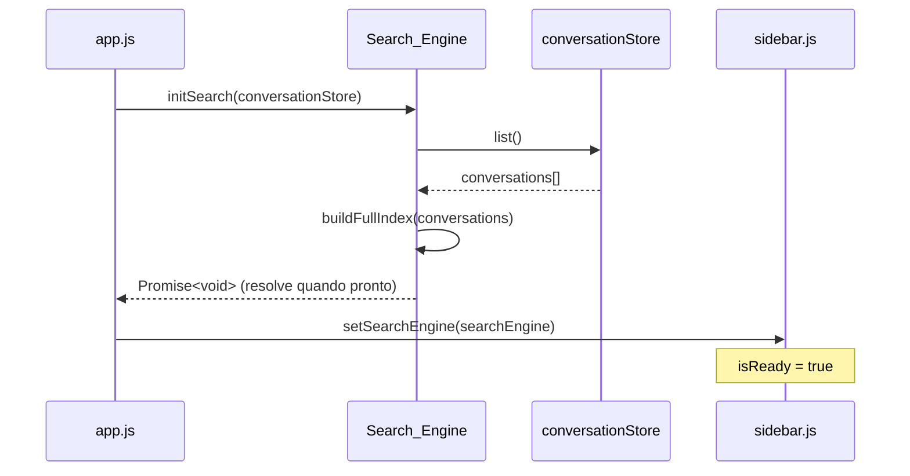
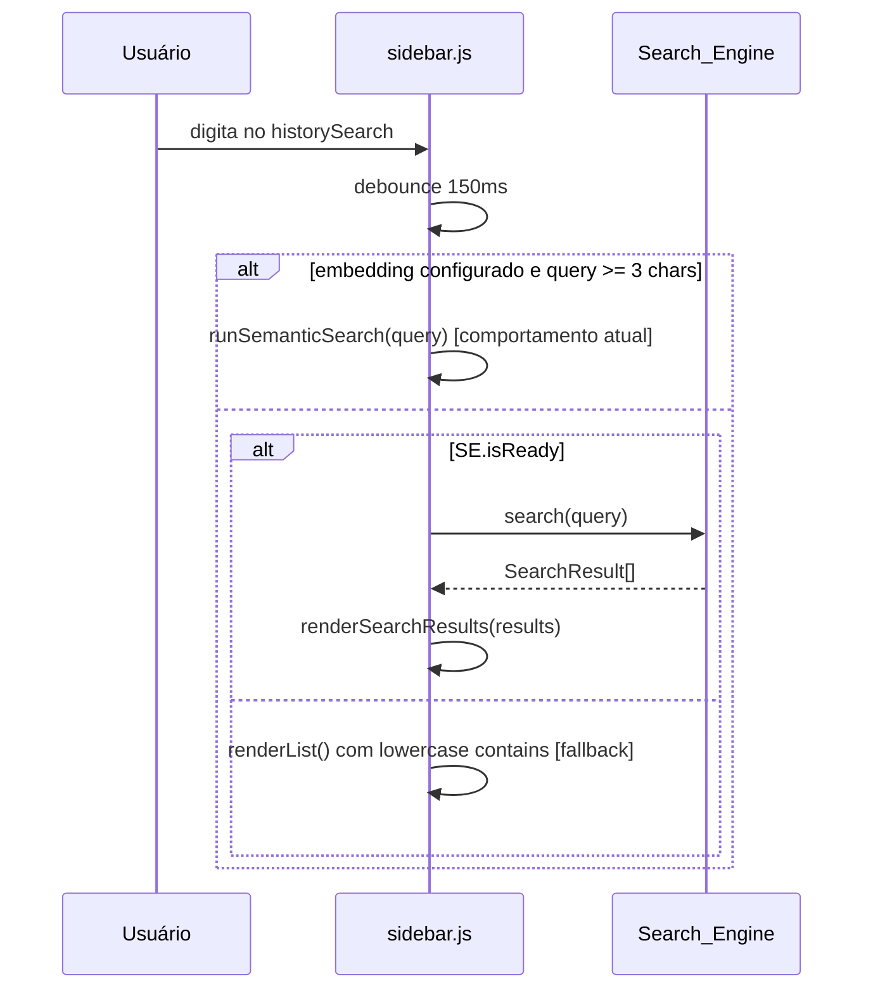
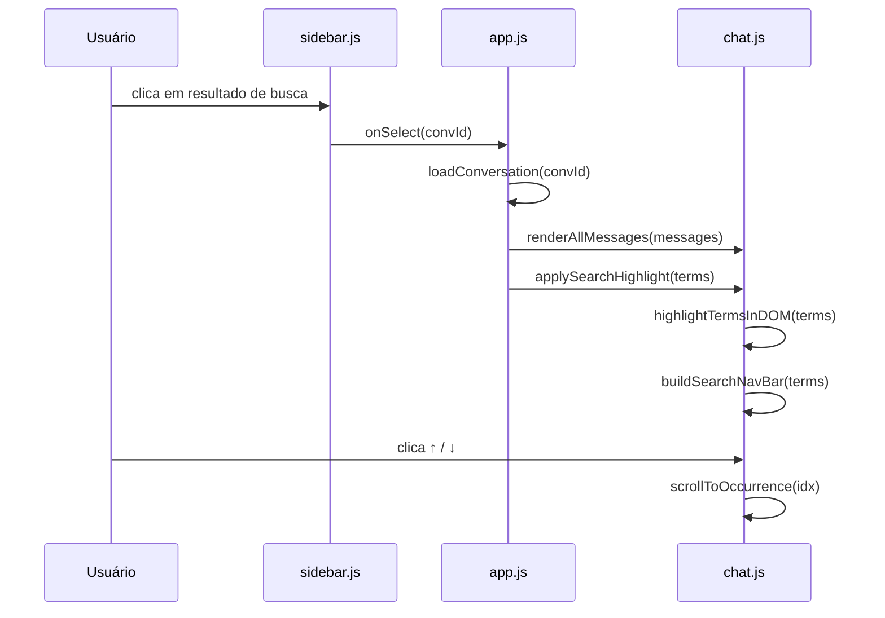

# Design Técnico — Busca Full-Text em Conversas

## Visão Geral

Esta feature substitui o filtro `lowercase contains` da sidebar por uma **busca full-text** baseada em índice invertido em memória, sem dependências externas e sem servidor. O design segue os princípios do projeto: vanilla JS, ES modules nativos, zero deps no client.

O fluxo central é:

1. Na inicialização, o `Search_Engine` lê todas as conversas do `conversationStore` e constrói o `Inverted_Index` em memória.
2. Quando o usuário digita no campo `historySearch`, o `Sidebar_Module` consulta o `Search_Engine` (com debounce de 150ms) e renderiza os resultados com snippets destacados.
3. Ao abrir uma conversa a partir de um resultado de busca, o `Chat_Module` aplica highlight em todas as ocorrências dos termos buscados e exibe uma barra de navegação entre ocorrências.
4. Quando uma conversa é criada, atualizada ou removida, o `Search_Engine` atualiza o índice incrementalmente.
5. A busca semântica (quando configurada) continua disponível e tem prioridade sobre a busca full-text para queries com 3+ caracteres.

### Escopo

- Módulo `modules/search.js` com `Tokenizer`, `Inverted_Index` e API de busca.
- Indexação incremental: upsert/remove atualizam apenas a conversa afetada.
- Busca multi-termo com semântica AND implícito, ordenada por score (contagem de ocorrências).
- Geração de snippets de até 120 caracteres com marcadores `==termo==`.
- Integração na `sidebar.js`: substituição do filtro existente, renderização de snippets.
- Integração no `chat.js`: highlight de ocorrências e barra de navegação.
- Fallback para `lowercase contains` enquanto o índice não está pronto.

---

## Arquitetura

### Diagrama de Módulos

```mermaid
graph TD
    A[app.js] -->|initSearch / notifyUpsert / notifyRemove| B[Search_Engine\nmodules/search.js]
    B -->|tokenize| C[Tokenizer\n(função pura exportada)]
    B -->|buildIndex| D[Inverted_Index\n(Map em memória)]
    B -->|generateSnippet| E[Snippet_Generator\n(função pura exportada)]
    A -->|conversationStore.upsert| F[storage.js]
    F -->|notifica| A
    A -->|notifyUpsert| B
    G[sidebar.js] -->|search / searchReady| B
    G -->|renderSnippets| H[DOM\nhistoryList]
    I[chat.js] -->|highlightTerms / buildNavBar| J[DOM\nmessagesInner]
    A -->|setSearchTerms| I
```

### Fluxo de Inicialização



### Fluxo de Busca na Sidebar



### Fluxo de Highlight no Chat



---

## Componentes e Interfaces

### `modules/search.js` (novo módulo)

Módulo ES novo. Exporta o `Search_Engine` como objeto singleton e funções puras para testabilidade.

```js
// ── Funções puras (exportadas para testes) ──────────────────────────────────

/**
 * Tokeniza uma string: lowercase, remove acentos (NFD + strip combining),
 * split por não-alfanuméricos, descarta tokens com length < 2.
 * @param {string} text
 * @returns {string[]} array de terms normalizados
 */
export function tokenize(text)

/**
 * Gera um snippet de até 120 chars centrado na primeira ocorrência de qualquer
 * term em content. Adiciona "…" no início/fim quando truncado.
 * Delimita ocorrências com ==term==.
 * @param {string} content  - conteúdo original da mensagem
 * @param {string[]} terms  - terms normalizados a destacar
 * @returns {string}        - snippet com marcadores ==
 */
export function generateSnippet(content, terms)

/**
 * Conta o número total de ocorrências de todos os terms em content normalizado.
 * @param {string} content
 * @param {string[]} terms
 * @returns {number}
 */
export function countOccurrences(content, terms)

// ── Search_Engine (singleton) ───────────────────────────────────────────────

/**
 * Inicializa o índice a partir do conversationStore.
 * Resolve quando o índice estiver pronto para consultas.
 * Em caso de erro no store, loga e inicializa com índice vazio.
 * @param {object} store - conversationStore
 * @returns {Promise<void>}
 */
export async function initSearch(store)

/**
 * Retorna true quando o índice inicial foi construído.
 * @returns {boolean}
 */
export function isSearchReady()

/**
 * Busca conversas que contenham todos os terms da query (AND implícito).
 * Retorna lista completa quando query tokeniza para zero terms.
 * @param {string} query
 * @param {object[]} allConversations - lista completa para fallback de query vazia
 * @returns {SearchResult[]}
 */
export function search(query, allConversations)

/**
 * Atualiza o índice para uma conversa específica (upsert incremental).
 * @param {object} conv - Conversation
 */
export function notifyUpsert(conv)

/**
 * Remove todas as entradas do índice para uma conversa.
 * @param {string} convId
 */
export function notifyRemove(convId)
```

**Estrutura interna do `Inverted_Index`:**

```js
// Map<term: string, Map<convId: string, { positions: number[], messageIdxs: number[] }>>
const invertedIndex = new Map();

// Map<convId: string, { title: string, messageCount: number }>
// Cache de metadados para montar SearchResult sem re-ler o store
const convMeta = new Map();
```

**Estrutura de `SearchResult`:**

```js
{
  convId: string,
  title: string,
  snippets: [
    { role: "user" | "assistant" | "title", text: string, messageIdx: number }
  ],  // até 2 snippets
  score: number,  // total de ocorrências de todos os terms
}
```

**Algoritmo de busca:**

```
1. terms = tokenize(query)
2. Se terms.length === 0: retornar allConversations mapeadas para SearchResult sem snippets
3. Para cada term em terms:
   a. Obter posting list do invertedIndex (Map<convId, ...>)
   b. Intersectar com conjunto de convIds candidatos (AND)
4. Para cada convId candidato:
   a. score = sum(occurrences de cada term na conversa)
   b. Gerar até 2 snippets das mensagens com maior densidade
5. Ordenar por score decrescente
6. Retornar SearchResult[]
```

### Modificações em `modules/ui/sidebar.js`

Novas responsabilidades:

```js
// Estado adicional
let searchEngine = null;   // referência ao módulo search.js
let searchDebounceTimer = null;

// Nova função: recebe referência ao search engine
export function setSearchEngine(engine)

// Modificação em initSidebar: registrar handler de input com debounce 150ms
// Modificação em renderList: usar searchEngine.search() quando disponível
// Nova função: renderizar resultados com snippets
function renderSearchResults(results)

// Nova função: renderizar item com snippets
function renderSearchItem(result)

// Nova função: converter marcadores ==texto== em <mark>texto</mark> (sem innerHTML)
function renderSnippetText(snippetText, container)
```

**Modificação no handler de input:**

```js
elements.historySearch.addEventListener("input", () => {
  const raw = elements.historySearch.value;
  searchTerm = raw.toLowerCase().trim();

  if (searchDebounceTimer) clearTimeout(searchDebounceTimer);
  if (semanticDebounceTimer) { clearTimeout(semanticDebounceTimer); semanticDebounceTimer = null; }
  if (semanticAbortController) { semanticAbortController.abort(); semanticAbortController = null; }

  if (!searchTerm) {
    elements.historySearch.removeAttribute("data-search-mode");
    renderList();
    return;
  }

  const cfg = getEmbedConfig?.();
  if (searchTerm.length >= 3 && cfg?.model && cfg?.baseUrl) {
    // Busca semântica (comportamento atual) — prioridade
    elements.historySearch.dataset.searchMode = "semantic";
    semanticDebounceTimer = setTimeout(() => runSemanticSearch(searchTerm), 400);
    return;
  }

  // Busca full-text com debounce 150ms
  searchDebounceTimer = setTimeout(() => {
    if (searchEngine && searchEngine.isSearchReady()) {
      elements.historySearch.dataset.searchMode = "fulltext";
      const results = searchEngine.search(searchTerm, allConversations);
      renderSearchResults(results);
    } else {
      // Fallback: lowercase contains enquanto índice não está pronto
      elements.historySearch.removeAttribute("data-search-mode");
      renderList();
    }
  }, 150);
});
```

**Renderização de snippets (sem innerHTML com conteúdo não-sanitizado):**

```js
function renderSnippetText(snippetText, container) {
  // Divide por marcadores ==...== e cria nós de texto e <mark> alternados
  const parts = snippetText.split(/(==.+?==)/g);
  for (const part of parts) {
    if (part.startsWith("==") && part.endsWith("==")) {
      const mark = document.createElement("mark");
      mark.textContent = part.slice(2, -2);
      container.appendChild(mark);
    } else {
      container.appendChild(document.createTextNode(part));
    }
  }
}
```

### Modificações em `modules/ui/chat.js`

Novas funções para highlight e navegação:

```js
// Estado de busca no chat
let activeSearchTerms = [];    // terms normalizados ativos
let searchOccurrences = [];    // NodeList de elementos .search-highlight
let activeOccurrenceIdx = -1;  // índice da ocorrência ativa

/**
 * Aplica highlight nos terms buscados em todas as mensagens renderizadas.
 * Cria elementos <mark class="search-highlight"> para cada ocorrência.
 * Exibe a barra de navegação se houver pelo menos 1 ocorrência.
 * @param {string[]} terms - terms normalizados (output do tokenize)
 */
export function applySearchHighlight(terms)

/**
 * Remove todos os highlights e oculta a barra de navegação.
 */
export function clearSearchHighlight()

/**
 * Navega para a próxima/anterior ocorrência (circular).
 * @param {number} direction - +1 para próximo, -1 para anterior
 */
export function navigateSearchOccurrence(direction)
```

**Algoritmo de highlight no DOM:**

```
1. Para cada .msg-body no messagesInner:
   a. Obter textContent do nó
   b. Normalizar (lowercase + strip accents)
   c. Encontrar posições de todos os terms
   d. Reconstruir o conteúdo do nó substituindo ocorrências por <mark class="search-highlight">
      usando TreeWalker para percorrer Text nodes sem quebrar o HTML existente
2. Coletar todos os .search-highlight em searchOccurrences
3. Se searchOccurrences.length > 0: exibir barra de navegação
```

> **Nota**: O highlight é aplicado sobre o DOM já renderizado (markdown já processado). Usa `TreeWalker` para percorrer apenas `Text` nodes, evitando quebrar elementos existentes como `<code>`, `<a>`, etc.

**Barra de navegação:**

```js
// Elemento criado dinamicamente e inserido antes de #messagesInner
// <div id="search-nav-bar" class="search-nav-bar" role="search" aria-label="Navegação de busca">
//   <span class="search-nav-count">1 de 5</span>
//   <button class="search-nav-btn" data-dir="-1" aria-label="Ocorrência anterior">↑</button>
//   <button class="search-nav-btn" data-dir="1" aria-label="Próxima ocorrência">↓</button>
//   <button class="search-nav-close" aria-label="Fechar busca">✕</button>
// </div>
```

### Modificações em `app.js`

```js
// Import do novo módulo
import {
  initSearch, isSearchReady, search, notifyUpsert, notifyRemove,
} from "./modules/search.js";

// Import das novas funções do chat
import { applySearchHighlight, clearSearchHighlight } from "./modules/ui/chat.js";

// Estado de busca ativa
let activeSearchTerms = [];  // terms da última busca full-text

// 1. Inicialização: após initSidebar
await initSearch(conversationStore);
initSidebar({ ..., searchEngine: { search, isSearchReady } });

// 2. Ao salvar conversa: notificar o índice
async function saveCurrentConversation() {
  // ... código existente ...
  await conversationStore.upsert(c);
  notifyUpsert(c);           // ← novo
  refreshSidebar();
}

// 3. Ao deletar conversa: notificar o índice
async function deleteConversation(id) {
  await conversationStore.remove(id);
  notifyRemove(id);          // ← novo
  refreshSidebar();
}

// 4. Ao abrir conversa a partir de resultado de busca
async function loadConversation(id) {
  // ... código existente ...
  renderAllMessages(conv.messages || []);
  if (activeSearchTerms.length > 0) {
    requestAnimationFrame(() => applySearchHighlight(activeSearchTerms));
  }
}

// 5. Ao limpar busca na sidebar
function onSearchCleared() {
  activeSearchTerms = [];
  clearSearchHighlight();
}
```

---

## Modelos de Dados

### Estrutura do `Inverted_Index` (em memória)

```js
// Índice principal: term → convId → dados de posição
const invertedIndex = new Map();
// Map<string, Map<string, { count: number, messageIdxs: Set<number> }>>
// Exemplo:
// "machine" → {
//   "conv-123": { count: 3, messageIdxs: Set{0, 2} },
//   "conv-456": { count: 1, messageIdxs: Set{5} }
// }

// Metadados de conversas (para montar SearchResult sem re-ler o store)
const convMeta = new Map();
// Map<string, { title: string, messages: Message[] }>
// Mantido em memória para geração de snippets sem I/O
```

### Estrutura de `SearchResult`

```js
{
  convId: string,           // ID da conversa
  title: string,            // título da conversa
  snippets: [               // até 2 snippets
    {
      role: "user" | "assistant" | "title",
      text: string,         // snippet com marcadores ==termo==
      messageIdx: number,   // índice da mensagem (-1 para título)
    }
  ],
  score: number,            // total de ocorrências de todos os terms
}
```

### Nenhuma mudança no schema de storage

O `Inverted_Index` é mantido exclusivamente em memória. Nenhuma alteração em `modules/schema.js`, `localStorage` ou `IndexedDB` é necessária. O índice é reconstruído a cada inicialização da aplicação a partir dos dados já existentes no `conversationStore`.

### CSS — novos seletores

Adicionar em `styles.css`:

```css
/* Barra de navegação de busca no chat */
.search-nav-bar { ... }
.search-nav-count { ... }
.search-nav-btn { ... }
.search-nav-close { ... }

/* Highlight de ocorrências */
mark.search-highlight { background: var(--accent); color: var(--bg-0); border-radius: 2px; }
mark.search-highlight.active { outline: 2px solid var(--accent); }

/* Snippet na sidebar */
.history-item-snippet { ... }
.history-item-snippet mark { background: var(--accent-subtle); color: var(--fg-0); }

/* Indicador de modo de busca no campo */
#historySearch[data-search-mode="fulltext"] { ... }
```

---

## Correctness Properties

*A property is a characteristic or behavior that should hold true across all valid executions of a system — essentially, a formal statement about what the system should do. Properties serve as the bridge between human-readable specifications and machine-verifiable correctness guarantees.*

### Property 1: Normalização case-insensitive do Tokenizer

*Para qualquer* string `s`, `tokenize(s)` produz o mesmo array de terms que `tokenize(s.toUpperCase())` — a normalização é case-insensitive.

**Validates: Requirements 2.1, 2.5**

### Property 2: Idempotência do Tokenizer

*Para qualquer* string `s`, aplicar o tokenizer duas vezes produz o mesmo resultado que aplicar uma vez: `tokenize(tokenize(s).join(" "))` é equivalente a `tokenize(s)`.

**Validates: Requirements 2.6**

### Property 3: Terms contêm apenas caracteres alfanuméricos e têm comprimento mínimo 2

*Para qualquer* string `s`, todos os elements do array retornado por `tokenize(s)` satisfazem `/^[a-z0-9]{2,}$/` — apenas letras minúsculas e dígitos, comprimento mínimo 2.

**Validates: Requirements 2.3, 2.4**

### Property 4: Consistência pós-escrita (upsert → search)

*Para qualquer* conversa `conv` com pelo menos uma mensagem com conteúdo não-vazio, após `notifyUpsert(conv)`, `search(q, [conv])` onde `q` contém um term presente no conteúdo de `conv` SHALL incluir `conv` nos resultados.

**Validates: Requirements 1.2, 7.1, 7.5**

### Property 5: Remoção limpa o índice

*Para qualquer* conversa `conv` previamente indexada via `notifyUpsert(conv)`, após `notifyRemove(conv.id)`, `search(q, [])` onde `q` contém um term de `conv` SHALL retornar um array vazio (a conversa não aparece mais).

**Validates: Requirements 1.3**

### Property 6: Correção dos resultados de busca (AND implícito)

*Para qualquer* query `q` e qualquer conjunto de conversas indexadas, toda conversa retornada por `search(q, allConvs)` contém pelo menos uma ocorrência de cada term de `tokenize(q)` em seu conteúdo ou título.

**Validates: Requirements 3.1, 3.6**

### Property 7: Ordenação por score decrescente

*Para qualquer* query `q` e qualquer conjunto de conversas indexadas, os resultados de `search(q, allConvs)` estão ordenados de forma que `results[i].score >= results[i+1].score` para todo `i` válido.

**Validates: Requirements 3.2**

### Property 8: Limite de snippets por resultado

*Para qualquer* resultado de busca retornado por `search(q, allConvs)`, o campo `snippets` contém no máximo 2 elementos.

**Validates: Requirements 4.1**

### Property 9: Fidelidade do snippet (texto entre marcadores é substring do original)

*Para qualquer* snippet gerado por `generateSnippet(content, terms)`, o texto entre cada par de marcadores `==` é uma substring do `content` original após normalização (lowercase + strip accents).

**Validates: Requirements 4.6**

---

## Tratamento de Erros

### Erros na inicialização do índice

| Situação | Comportamento |
|---|---|
| `conversationStore.list()` lança erro | Loga no console: `[Search] Erro ao inicializar índice: <msg>`. Inicializa com índice vazio. A aplicação continua funcionando. |
| Conversa com `messages` ausente ou não-array | Ignora silenciosamente — `messages` é tratado como `[]`. |
| Mensagem com `content` null/undefined/vazio | Ignora a mensagem durante indexação — sem erro. |
| Mensagem com `content` não-string (ex: array multimodal) | Extrai apenas partes `type: "text"` se for array; ignora caso contrário. |

### Erros durante busca

| Situação | Comportamento |
|---|---|
| `search()` chamado antes de `initSearch()` | Retorna `[]` imediatamente. |
| Query com apenas caracteres especiais | `tokenize()` retorna `[]` → `search()` retorna lista completa de conversas. |
| Índice vazio (nenhuma conversa) | `search()` retorna `[]` para qualquer query não-vazia. |

### Erros no highlight do chat

| Situação | Comportamento |
|---|---|
| `applySearchHighlight()` chamado com terms vazios | Não faz nada; não exibe barra de navegação. |
| Conversa sem ocorrências dos terms buscados | Não exibe barra de navegação (Requisito 6.7). |
| Erro no `TreeWalker` ao percorrer DOM | Capturado silenciosamente; highlight parcial é melhor que crash. |

### Degradação graciosa

- Enquanto o índice não está pronto (`isSearchReady() === false`), a sidebar usa o filtro `lowercase contains` existente como fallback — sem regressão de comportamento.
- Se a busca semântica está configurada, ela tem prioridade para queries com 3+ chars — o `Search_Engine` não é chamado nesses casos.
- Conversas com `content` array (mensagens multimodais) são indexadas apenas pelo texto — partes de imagem são ignoradas.

---

## Estratégia de Testes

### Abordagem dual

- **Testes de exemplo**: comportamentos específicos de UI, casos de borda, integrações.
- **Testes de propriedade** (fast-check): propriedades universais sobre o `Tokenizer`, `Search_Engine` e `generateSnippet`.

### Funções testáveis por propriedade (módulos puros, sem DOM)

Todas exportadas de `modules/search.js`:

- `tokenize(text)` — função pura, sem efeitos colaterais
- `generateSnippet(content, terms)` — função pura, sem efeitos colaterais
- `countOccurrences(content, terms)` — função pura, sem efeitos colaterais
- `search(query, allConversations)` — após `notifyUpsert` / `notifyRemove` (estado em memória)
- `notifyUpsert(conv)` / `notifyRemove(convId)` — mutam o índice em memória

### Arquivo de testes

Adicionar ao arquivo existente `tests/feature-improvements.test.js` (seguindo o padrão já estabelecido no projeto).

### Configuração de testes de propriedade

- Biblioteca: **fast-check** (já usada no projeto — `tests/package.json`)
- Mínimo de 100 iterações por propriedade (`numRuns: 100`)
- Tag de referência: `// Feature: conversation-search, Property N: <texto>`

### Cobertura por propriedade

| Property | Gerador fast-check | O que verifica |
|---|---|---|
| P1: Normalização case-insensitive | `fc.string()` | `tokenize(s)` deep-equals `tokenize(s.toUpperCase())` |
| P2: Idempotência do Tokenizer | `fc.string()` | `tokenize(tokenize(s).join(" "))` deep-equals `tokenize(s)` |
| P3: Terms alfanuméricos com length >= 2 | `fc.string()` | Todos os terms satisfazem `/^[a-z0-9]{2,}$/` |
| P4: Consistência pós-escrita | `fc.record(conv com messages não-vazias)` | Após upsert, search retorna a conversa |
| P5: Remoção limpa o índice | `fc.record(conv)` | Após upsert + remove, search não retorna a conversa |
| P6: Correção AND implícito | `fc.array(conv)` + `fc.string()` | Todos os resultados contêm todos os terms da query |
| P7: Ordenação por score | `fc.array(conv)` + `fc.string()` | `results[i].score >= results[i+1].score` |
| P8: Limite de snippets | `fc.array(conv)` + `fc.string()` | `result.snippets.length <= 2` para todo resultado |
| P9: Fidelidade do snippet | `fc.string()` + `fc.array(fc.string())` | Texto entre `==` é substring do original normalizado |

### Testes de exemplo (não-PBT)

- `tokenize("")` retorna `[]`.
- `tokenize("Olá mundo")` retorna `["ola", "mundo"]` (acento removido).
- `tokenize("a b c")` retorna `[]` (todos com length < 2).
- `search("", allConvs)` retorna todas as conversas.
- `search("xyz_inexistente", allConvs)` retorna `[]`.
- Após `initSearch` com store que lança erro: `isSearchReady()` retorna `true` e `search()` retorna `[]`.
- `generateSnippet("hello world foo", ["world"])` retorna string contendo `==world==`.
- Snippet não excede 120 caracteres (sem contar marcadores `==`).
- Snippet com truncamento adiciona `…` no início e/ou fim.
- Sidebar exibe "Sem resultados" quando `search()` retorna `[]`.
- Barra de navegação não aparece quando conversa não tem ocorrências dos terms.
- `clearSearchHighlight()` remove todos os elementos `.search-highlight` do DOM.
- Navegação circular: após última ocorrência, `navigateSearchOccurrence(1)` volta para a primeira.
