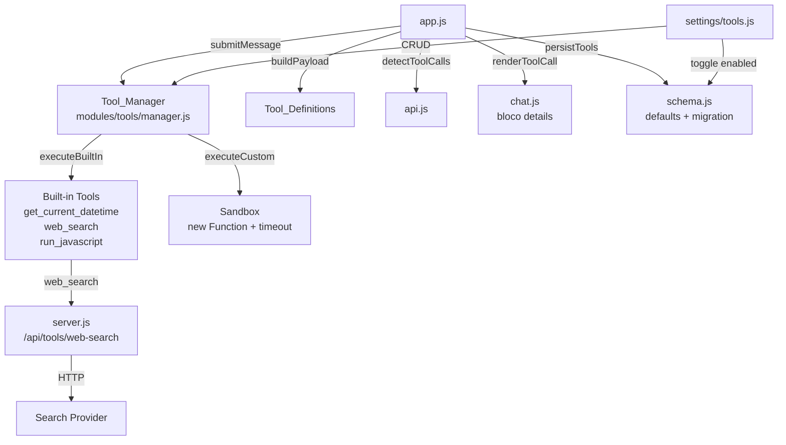
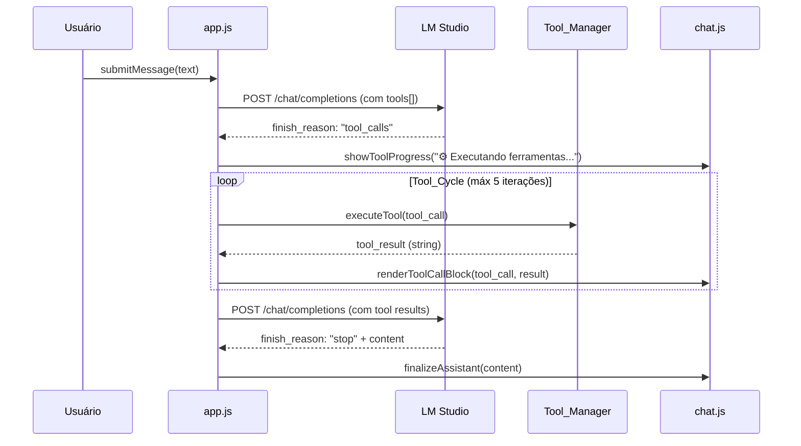

# Design Técnico — Function Calling / Tools

## Visão Geral

Esta feature expõe a capacidade de **function calling** da API OpenAI-compatible do LM Studio na interface do Offline AI Chat. O design segue os princípios do projeto: vanilla JS sem dependências no client, módulos ES nativos, estado reativo via `store.js`, e persistência em localStorage.

O fluxo central é:

1. O usuário habilita ferramentas em um perfil via Settings → Ferramentas.
2. O `App_Module` inclui as `Tool_Definitions` no payload enviado ao LM Studio.
3. Se o modelo responde com `finish_reason: "tool_calls"`, o `App_Module` detecta e inicia um `Tool_Cycle`.
4. O `Tool_Manager` executa cada ferramenta (built-in ou customizada no Sandbox).
5. Os resultados são devolvidos ao modelo como mensagens `role: "tool"`.
6. O modelo produz a resposta final, que é renderizada normalmente.
7. O `Chat_Module` renderiza blocos colapsáveis `<details>` para cada tool call no histórico.

### Escopo

- Ferramentas built-in: `get_current_datetime`, `web_search`, `run_javascript`.
- Ferramentas customizadas: definidas pelo usuário com código JS executado em Sandbox.
- Ciclo automático com limite de 5 iterações.
- Modo de confirmação manual opcional.
- Endpoint proxy `/api/tools/web-search` no servidor Node.
- Configuração por perfil (quais ferramentas ficam ativas).

---

## Arquitetura

### Diagrama de Módulos



### Fluxo do Tool_Cycle



---

## Componentes e Interfaces

### Tool_Manager (`modules/tools/manager.js`)

Módulo ES novo. Responsável por registrar, listar, validar e executar ferramentas.

```js
// Registro e CRUD
export function registerBuiltIns()                          // popula registry com built-ins
export function listTools()                                 // → Tool[]
export function getToolDefinitions(enabledIds)              // → OpenAI Tool_Definition[]
export function addCustomTool(toolDef)                      // → { ok, error? }
export function removeCustomTool(id)                        // → { ok, error? }
export function validateToolName(name)                      // → boolean
export function validateParametersSchema(schema)            // → { ok, error? }

// Execução
export async function executeTool(toolCall, registry)       // → string (Tool_Result content)
export function serializeToolResult(value)                  // → string
export async function runInSandbox(code, args, timeoutMs)   // → string
```

**Estrutura de Tool no registry:**

```js
{
  id: string,           // uuid ou slug built-in
  name: string,         // snake_case, [a-z0-9_]{1,64}
  description: string,
  parameters: {         // JSON Schema object
    type: "object",
    properties: { ... },
    required: [...]
  },
  implementation: string | "builtin:<name>",
  enabled: boolean,
  builtIn: boolean,
}
```

**Estrutura OpenAI Tool_Definition (enviada no payload):**

```js
{
  type: "function",
  function: {
    name: string,
    description: string,
    parameters: { type: "object", properties: {...}, required: [...] }
  }
}
```

### Sandbox (`runInSandbox`)

Executa código JS customizado de forma isolada usando `new Function` com escopo restrito. Globals proibidos (`window`, `document`, `fetch`, `XMLHttpRequest`) são explicitamente bloqueados passando `undefined` como parâmetro com o mesmo nome.

```js
async function runInSandbox(code, args, timeoutMs = 5000) {
  return new Promise((resolve, reject) => {
    const timer = setTimeout(() => reject(new Error("timeout")), timeoutMs);
    try {
      const fn = new Function(
        "window", "document", "fetch", "XMLHttpRequest", "args",
        `"use strict"; ${code}`
      );
      const result = fn(undefined, undefined, undefined, undefined, args);
      clearTimeout(timer);
      resolve(serializeToolResult(result));
    } catch (err) {
      clearTimeout(timer);
      reject(err);
    }
  });
}
```

> **Nota de segurança**: `new Function` não é um sandbox hermético — código malicioso pode escapar via `arguments.callee.caller` ou prototype chains em engines não-strict. Para o escopo desta feature (ferramentas definidas pelo próprio usuário), o nível de isolamento é suficiente. Não expor execução de código de terceiros sem revisão adicional.

### Modificações em `app.js`

Novas funções a adicionar:

```js
// Detecção de tool calls na resposta
function isToolCallResponse(apiResponse)                    // → boolean
function extractToolCalls(apiResponse)                      // → ToolCall[]

// Construção do payload com tools
function buildToolsPayload(profile, toolManager)            // → Tool_Definition[] | undefined

// Ciclo de tool use
async function runToolCycle(messages, toolCalls, profile, server, abortController)
// → { messages: Message[], finalContent: string, finalReasoning: string }

// Montagem das mensagens de resultado
function buildToolResultMessages(assistantMsg, toolResults) // → Message[]
```

### Modificações em `modules/api.js`

Adicionar extração de `tool_calls` do response:

```js
export function extractToolCalls(data) {
  return data?.choices?.[0]?.message?.tool_calls || null;
}

export function extractFinishReason(data) {
  return data?.choices?.[0]?.finish_reason || null;
}
```

### Modificações em `modules/ui/chat.js`

Novas funções de renderização:

```js
export function renderToolCallBlock(body, toolCall, result) // → void
export function showToolProgress(body)                      // → void (substitui typing indicator)
export function formatToolCallArgs(args)                    // → string (JSON indentado)
```

### Novo módulo `modules/ui/settings/tools.js`

Painel de configuração de ferramentas no drawer de settings:

```js
export function panelTools()  // renderiza seção de ferramentas no settingsBody
```

### Endpoint `server.js` — `/api/tools/web-search`

Novo handler adicionado em `handleApi`:

```js
if (pathname === "/api/tools/web-search") return handleToolsWebSearch(body, response);
```

```js
async function handleToolsWebSearch(body, response) {
  const query = typeof body.query === "string" ? body.query.trim() : "";
  if (!query) {
    sendJson(response, 400, { error: "query obrigatória" });
    return;
  }
  if (query.length > 500) {
    sendJson(response, 400, { error: "query excede 500 caracteres" });
    return;
  }
  // Implementação: DuckDuckGo Instant Answer API (sem chave, sem CORS)
  // ou fallback para scraping leve via https://html.duckduckgo.com/html/
  try {
    const results = await fetchWebSearchResults(query);
    sendJson(response, 200, { results });
  } catch (err) {
    sendJson(response, 502, { error: err.message });
  }
}
```

---

## Modelos de Dados

### Schema — `defaults()` em `modules/schema.js`

Adicionar chave `tools` no objeto retornado por `defaults()`:

```js
tools: [
  {
    id: "builtin-get_current_datetime",
    name: "get_current_datetime",
    description: "Retorna a data e hora atual com timezone do browser no formato ISO 8601.",
    parameters: { type: "object", properties: {}, required: [] },
    implementation: "builtin:get_current_datetime",
    enabled: false,
    builtIn: true,
  },
  {
    id: "builtin-web_search",
    name: "web_search",
    description: "Busca na web e retorna os primeiros resultados com título, URL e snippet.",
    parameters: {
      type: "object",
      properties: {
        query: { type: "string", description: "Termo de busca" }
      },
      required: ["query"]
    },
    implementation: "builtin:web_search",
    enabled: false,
    builtIn: true,
  },
  {
    id: "builtin-run_javascript",
    name: "run_javascript",
    description: "Executa código JavaScript e retorna o resultado. Sem acesso a DOM, fetch ou rede.",
    parameters: {
      type: "object",
      properties: {
        code: { type: "string", description: "Código JavaScript a executar" }
      },
      required: ["code"]
    },
    implementation: "builtin:run_javascript",
    enabled: false,
    builtIn: true,
  },
],
```

### Schema — `profile` (em `profiles[]`)

Adicionar campo `tools` em cada perfil:

```js
{
  id: "personal",
  // ... campos existentes ...
  tools: [],  // array de IDs de ferramentas habilitadas neste perfil
}
```

### Schema — `advanced`

Adicionar sub-objeto `tools`:

```js
advanced: {
  // ... campos existentes ...
  tools: {
    requireConfirmation: false,
  }
}
```

### Estrutura de mensagem com tool_calls (histórico)

Mensagem `assistant` com tool calls (salva no histórico):

```js
{
  role: "assistant",
  content: "",           // pode ser vazio quando finish_reason é tool_calls
  tool_calls: [          // array de tool calls do modelo
    {
      id: "call_abc123",
      type: "function",
      function: {
        name: "get_current_datetime",
        arguments: "{}"
      }
    }
  ],
  ts: 1234567890,
  id: "m-xxx-a"
}
```

Mensagem `tool` (resultado, salva no histórico):

```js
{
  role: "tool",
  tool_call_id: "call_abc123",
  content: "2025-01-15T14:30:00.000-03:00",
  ts: 1234567890,
  id: "m-xxx-t"
}
```

### Migração suave em `loadAndMigrate()`

```js
// Soft migration: adiciona tools[] se ausente
if (!Array.isArray(target.tools)) {
  target.tools = defaults().tools;
}
// Soft migration: adiciona profile.tools se ausente
if (Array.isArray(target.profiles)) {
  for (const p of target.profiles) {
    if (!Array.isArray(p.tools)) p.tools = [];
  }
}
// Soft migration: adiciona advanced.tools se ausente
if (target.advanced && !target.advanced.tools) {
  target.advanced.tools = { requireConfirmation: false };
}
```

---

## Correctness Properties

*A property is a characteristic or behavior that should hold true across all valid executions of a system — essentially, a formal statement about what the system should do. Properties serve as the bridge between human-readable specifications and machine-verifiable correctness guarantees.*

### Property 1: Validação de nome de ferramenta

*Para qualquer* string `name`, `validateToolName(name)` retorna `true` se e somente se `name` satisfaz `/^[a-z0-9_]{1,64}$/`.

**Validates: Requirements 1.3**

### Property 2: Detecção de duplicata preserva o registry

*Para qualquer* registry com N ferramentas e qualquer tentativa de adicionar uma ferramenta com um `name` já existente, `addCustomTool()` retorna um objeto com `ok: false` e o registry permanece com N ferramentas inalteradas.

**Validates: Requirements 1.4**

### Property 3: Remoção de ferramenta é precisa

*Para qualquer* registry com N ferramentas (N ≥ 1), remover uma ferramenta pelo seu `id` resulta em um registry com N-1 ferramentas onde a ferramenta removida não está presente e todas as demais permanecem inalteradas.

**Validates: Requirements 1.5**

### Property 4: Formato ISO 8601 da ferramenta get_current_datetime

*Para qualquer* execução de `get_current_datetime`, o resultado é uma string que satisfaz o padrão ISO 8601 com timezone (ex: `2025-01-15T14:30:00.000-03:00`), verificável via `/^\d{4}-\d{2}-\d{2}T\d{2}:\d{2}:\d{2}\.\d{3}[+-]\d{2}:\d{2}$|Z$/`.

**Validates: Requirements 2.1**

### Property 5: Captura de erros no Sandbox

*Para qualquer* código JavaScript que lança uma exceção com mensagem `msg`, `executeTool()` com `run_javascript` retorna a string `"Erro: " + msg` sem propagar a exceção.

**Validates: Requirements 2.6**

### Property 6: Bloqueio de globals proibidos no Sandbox

*Para qualquer* identificador em `["window", "document", "fetch", "XMLHttpRequest"]`, código que tenta acessar esse identificador no Sandbox resulta em um Tool_Result contendo `"Erro:"` (ReferenceError capturado).

**Validates: Requirements 7.5**

### Property 7: Serialização do resultado de ferramenta customizada

*Para qualquer* valor de retorno `v` de uma ferramenta customizada:
- Se `v` é objeto ou array → resultado é `JSON.stringify(v)`
- Se `v` é primitivo (string, number, boolean) → resultado é `String(v)`
- Se `v` é `undefined` ou `null` → resultado é `"(sem resultado)"`

**Validates: Requirements 7.6**

### Property 8: Filtragem de ferramentas habilitadas no payload

*Para qualquer* lista de ferramentas com estados `enabled` mistos, `buildToolsPayload()` retorna exatamente as ferramentas com `enabled: true`, e retorna `undefined` quando nenhuma ferramenta está habilitada.

**Validates: Requirements 3.3, 3.4**

### Property 9: Detecção de tool_calls na resposta da API

*Para qualquer* objeto de resposta da API, `isToolCallResponse()` retorna `true` se e somente se `finish_reason === "tool_calls"` e `message.tool_calls` é um array não-vazio.

**Validates: Requirements 4.1**

### Property 10: Construção das mensagens de Tool_Result

*Para qualquer* lista de tool calls e seus resultados correspondentes, `buildToolResultMessages()` produz um array de mensagens onde: (a) a primeira mensagem é a mensagem `assistant` com `tool_calls`, (b) cada mensagem subsequente tem `role: "tool"` e `tool_call_id` correspondente ao `id` do tool call, e (c) o número total de mensagens é `1 + len(tool_calls)`.

**Validates: Requirements 4.4**

### Property 11: Validação de JSON Schema de parâmetros

*Para qualquer* objeto que não seja um JSON Schema válido com `type: "object"` e `properties` como objeto, `validateParametersSchema()` retorna `{ ok: false }`. Para qualquer objeto que satisfaça a estrutura mínima, retorna `{ ok: true }`.

**Validates: Requirements 7.2**

### Property 12: Formatação de argumentos de tool call

*Para qualquer* objeto JSON-serializável `args`, `formatToolCallArgs(args)` retorna `JSON.stringify(args, null, 2)`.

**Validates: Requirements 6.2**

### Property 13: Validação do comprimento da query no servidor

*Para qualquer* string `query`, o handler `/api/tools/web-search` aceita a query (não retorna 400 por comprimento) se e somente se `query.length <= 500`.

**Validates: Requirements 8.3**

---

## Tratamento de Erros

### Erros no Tool_Cycle

| Situação | Comportamento |
|---|---|
| Ferramenta não encontrada no registry | Tool_Result: `"Erro: ferramenta '<name>' não encontrada"` — ciclo continua |
| Timeout no Sandbox (>5000ms) | Tool_Result: `"Erro: timeout de execução (5000ms) excedido"` |
| Exceção no Sandbox | Tool_Result: `"Erro: <mensagem do erro>"` |
| Falha na `web_search` (HTTP 502) | Tool_Result: `"Erro: <mensagem descritiva do servidor>"` |
| Limite de 5 iterações atingido | Toast de erro ao usuário: `"Limite de iterações de ferramentas atingido (5)"` — ciclo encerrado |
| AbortController acionado | Ciclo interrompido imediatamente; conteúdo parcial exibido |

### Erros de validação (Settings)

| Situação | Comportamento |
|---|---|
| `name` inválido (chars proibidos ou fora de 1-64) | Toast `"error"`: `"Nome inválido: use apenas letras minúsculas, números e _"` |
| `name` duplicado | Toast `"error"`: `"Já existe uma ferramenta com o nome '<name>'"` |
| JSON Schema de parâmetros inválido | Toast `"error"`: `"Schema de parâmetros inválido: <detalhe>"` |

### Erros no servidor (`/api/tools/web-search`)

| Situação | HTTP | Body |
|---|---|---|
| `query` ausente ou vazia | 400 | `{ error: "query obrigatória" }` |
| `query` > 500 chars | 400 | `{ error: "query excede 500 caracteres" }` |
| Falha na busca upstream | 502 | `{ error: "<mensagem descritiva>" }` |
| Método não-POST | 405 | `{ error: { message: "Método não permitido." } }` |

### Degradação graciosa

- Se o modelo não suporta tools (não retorna `tool_calls`), o fluxo é idêntico ao atual — nenhuma mudança de comportamento.
- Se `tools[]` está vazio no payload (nenhuma ferramenta habilitada), o campo `tools` é omitido completamente — compatibilidade total com modelos sem suporte a tools.
- Ferramentas built-in com `enabled: false` por padrão garantem que usuários existentes não vejam mudança de comportamento ao atualizar.

---

## Estratégia de Testes

### Abordagem dual

- **Testes de exemplo**: comportamentos específicos, casos de borda, integrações.
- **Testes de propriedade** (fast-check): propriedades universais sobre validação, serialização e filtragem.

### Arquivo de testes

Adicionar ao arquivo existente `tests/feature-improvements.test.js` (ou criar `tests/tools.test.js` seguindo o mesmo padrão).

As funções testáveis por propriedade devem ser exportadas de módulos puros:

- `validateToolName(name)` — exportada de `modules/tools/manager.js`
- `serializeToolResult(value)` — exportada de `modules/tools/manager.js`
- `validateParametersSchema(schema)` — exportada de `modules/tools/manager.js`
- `formatToolCallArgs(args)` — exportada de `modules/ui/chat.js` (ou `modules/tools/manager.js`)
- `buildToolsPayload(tools)` — exportada de `modules/tools/manager.js`
- `isToolCallResponse(data)` — exportada de `modules/api.js`
- `buildToolResultMessages(assistantMsg, results)` — exportada de `modules/tools/manager.js`

### Configuração de testes de propriedade

- Biblioteca: **fast-check** (já usada no projeto — `tests/package.json`)
- Mínimo de 100 iterações por propriedade (`numRuns: 100`)
- Tag de referência: `// Feature: function-calling-tools, Property N: <texto>`

### Cobertura por propriedade

| Property | Teste |
|---|---|
| P1: validateToolName | `fc.string()` → verifica resultado === `/^[a-z0-9_]{1,64}$/.test(name)` |
| P2: Duplicata preserva registry | `fc.array(tool)` + `fc.string()` → verifica ok:false e registry inalterado |
| P3: Remoção precisa | `fc.array(tool, minLength:1)` → verifica N-1 e ausência do removido |
| P4: ISO 8601 datetime | Execução repetida → verifica regex ISO 8601 |
| P5: Captura de erros Sandbox | `fc.string()` como mensagem de erro → verifica `"Erro: " + msg` |
| P6: Bloqueio de globals | Para cada global proibido → verifica resultado contém `"Erro:"` |
| P7: Serialização de resultado | `fc.anything()` → verifica regras de serialização por tipo |
| P8: Filtragem de tools habilitadas | `fc.array(tool com enabled aleatório)` → verifica apenas enabled:true no payload |
| P9: Detecção de tool_calls | `fc.record(...)` com finish_reason variável → verifica boolean correto |
| P10: buildToolResultMessages | `fc.array(toolCall)` → verifica estrutura do array de mensagens |
| P11: validateParametersSchema | `fc.anything()` → verifica rejeição de schemas inválidos |
| P12: formatToolCallArgs | `fc.object()` → verifica `JSON.stringify(args, null, 2)` |
| P13: Validação de query length | `fc.string()` → verifica aceite/rejeição por comprimento |

### Testes de integração (não-PBT)

- Endpoint `/api/tools/web-search`: query vazia → 400, query > 500 chars → 400, upstream fail → 502.
- `web_search` built-in: mock fetch, verifica payload enviado ao endpoint.
- Tool_Cycle com 6 iterações: mock API sempre retorna tool_calls, verifica parada em 5.
- AbortController durante Tool_Cycle: verifica interrupção imediata.

### Testes de exemplo

- `get_current_datetime` retorna string com formato ISO 8601 válido.
- Ferramenta não encontrada retorna `"Erro: ferramenta 'xyz' não encontrada"`.
- Rejeição no modal de confirmação retorna `"Execução cancelada pelo usuário"`.
- `defaults()` inclui chave `tools` com 3 built-ins, todos `enabled: false`.
- Migração de config sem `tools` adiciona a chave corretamente.
