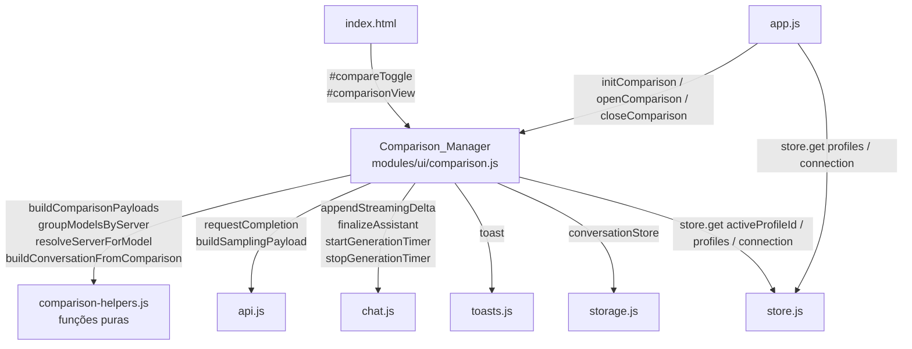
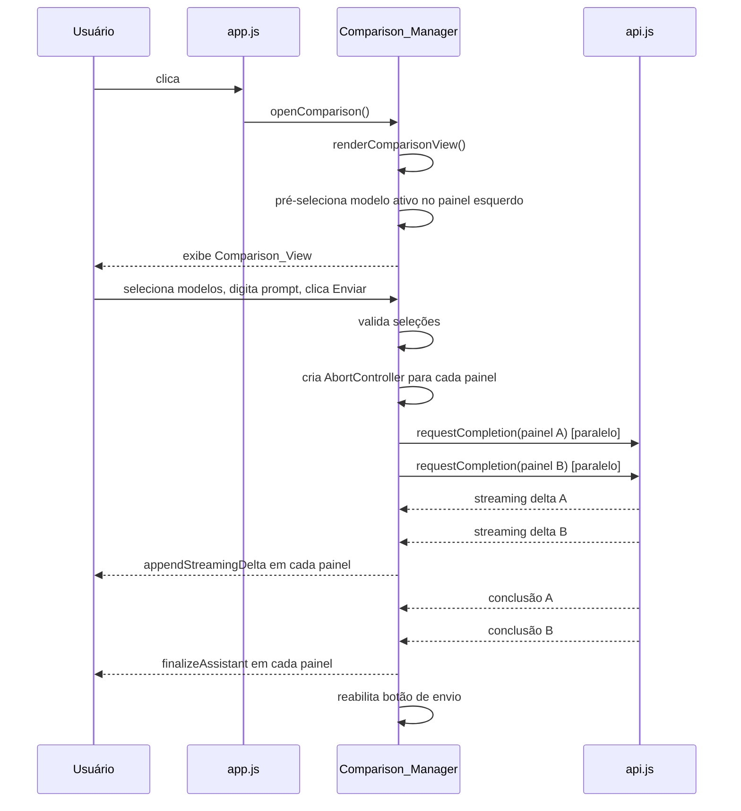
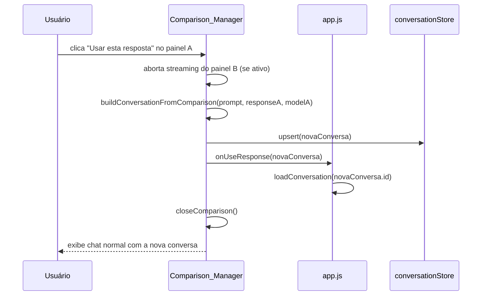
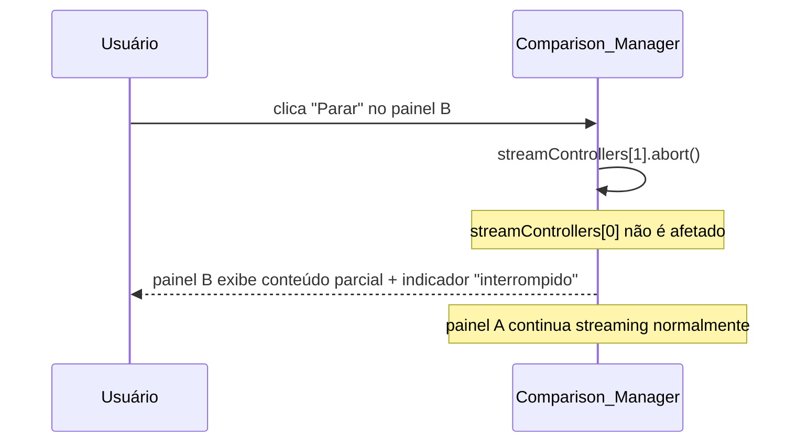

# Design Técnico — Comparação de Modelos Lado a Lado

## Visão Geral

Esta feature adiciona um **modo de comparação lado a lado** ao Offline AI Chat, permitindo que o usuário envie o mesmo prompt para dois modelos diferentes simultaneamente e visualize as respostas em colunas paralelas com streaming em tempo real.

O design segue os princípios do projeto: vanilla JS, ES modules nativos, zero deps no client, sem build step. Toda a lógica de orquestração fica em um novo módulo `modules/ui/comparison.js` (o `Comparison_Manager`), que é inicializado por `app.js` e opera de forma independente do fluxo de chat normal.

### Fluxo central

1. O usuário clica no botão "Comparar modelos" na topbar — o `Comparison_Manager` substitui a área de mensagens pela `Comparison_View`.
2. O usuário seleciona um modelo em cada `Comparison_Panel` via `Model_Selector` e digita o prompt no `Comparison_Composer`.
3. Ao enviar, o `Comparison_Manager` dispara duas requisições de completion em paralelo, cada uma com seu próprio `Stream_Controller` (`AbortController`).
4. Cada painel exibe os tokens chegando via `appendStreamingDelta`, com timer de progresso via `startGenerationTimer` — ambos reutilizados de `modules/ui/chat.js`.
5. Ao concluir, o usuário pode copiar a resposta ou acionar "Usar esta resposta", que cria uma nova conversa no chat principal com o par prompt + resposta escolhida.
6. A `Comparison_Session` é efêmera — nunca é persistida no `conversationStore`.

### Escopo

- Novo módulo `modules/ui/comparison.js` com toda a lógica de orquestração.
- Funções puras exportadas de `modules/ui/comparison-helpers.js` para testabilidade.
- Modificação em `app.js`: inicializar o `Comparison_Manager` e conectar ao ciclo de vida da aplicação.
- Modificação em `index.html`: adicionar botão de toggle na topbar e container da `Comparison_View`.
- Modificação em `styles.css`: estilos para layout de duas colunas, responsividade e estados visuais.
- Nenhuma mudança em `modules/schema.js` ou no schema de storage — a feature não persiste estado próprio.

---

## Arquitetura

### Diagrama de Módulos



### Fluxo de Ativação e Envio



### Fluxo de "Usar esta resposta"



### Fluxo de Cancelamento Individual



---

## Componentes e Interfaces

### `modules/ui/comparison-helpers.js` (novo módulo — funções puras)

Funções puras sem dependências de DOM, exportadas para testabilidade via Node.js.

```js
/**
 * Constrói os dois payloads de completion para a sessão de comparação.
 * Ambos os payloads compartilham o mesmo systemPrompt, sampling e histórico de mensagens.
 * Apenas o campo `model` difere entre eles.
 *
 * @param {object} opts
 * @param {string} opts.prompt          - texto do usuário
 * @param {string} opts.modelA          - modelo do painel esquerdo
 * @param {string} opts.modelB          - modelo do painel direito
 * @param {object} opts.profile         - perfil ativo { systemPrompt, sampling }
 * @param {object} opts.samplingOverride - parâmetros de sampling já processados (buildSamplingPayload)
 * @returns {{ payloadA: object, payloadB: object }}
 */
export function buildComparisonPayloads({ prompt, modelA, modelB, profile, samplingOverride })

/**
 * Agrupa uma lista plana de model IDs por servidor.
 * Quando há apenas um servidor, retorna um único grupo sem cabeçalho.
 * Quando há múltiplos servidores, cada grupo tem o nickname do servidor como label.
 *
 * @param {string[]} models             - lista de model IDs
 * @param {object[]} servers            - lista de servidores { id, nickname, baseUrl }
 * @param {Map<string, string>} modelToServerId - mapeamento modelId → serverId
 * @returns {Array<{ serverId: string, serverNickname: string, models: string[] }>}
 */
export function groupModelsByServer(models, servers, modelToServerId)

/**
 * Resolve qual servidor deve ser usado para um dado modelo.
 * Retorna o servidor cujo ID corresponde ao mapeamento, ou o servidor padrão como fallback.
 *
 * @param {string} modelId
 * @param {object[]} servers
 * @param {Map<string, string>} modelToServerId
 * @returns {object | null} servidor encontrado ou null
 */
export function resolveServerForModel(modelId, servers, modelToServerId)

/**
 * Constrói um objeto Conversation a partir do resultado de uma sessão de comparação.
 * A conversa contém exatamente dois mensagens: uma do usuário (prompt) e uma do assistente (resposta).
 * O campo reasoning não é incluído.
 *
 * @param {object} opts
 * @param {string} opts.prompt          - prompt enviado pelo usuário
 * @param {string} opts.response        - resposta do painel selecionado (sem reasoning)
 * @param {string} opts.model           - modelo do painel selecionado
 * @param {string} opts.profileId       - ID do perfil ativo
 * @param {string} opts.serverId        - ID do servidor do painel selecionado
 * @returns {object} Conversation { id, title, profileId, serverId, model, createdAt, updatedAt, messages }
 */
export function buildConversationFromComparison({ prompt, response, model, profileId, serverId })
```

### `modules/ui/comparison.js` (novo módulo — Comparison_Manager)

Módulo principal que orquestra a `Comparison_View`. Mantém estado interno efêmero (não persistido).

```js
// ── Estado interno ──────────────────────────────────────────────────────────

let isActive = false;
let store = null;
let onUseResponse = null;   // callback para app.js: (conversation) => void
let onClose = null;         // callback para app.js: () => void

// Estado da sessão atual
let sessionState = {
  prompt: "",
  modelA: null,             // string | null
  modelB: null,             // string | null
  responseA: "",
  responseB: "",
  streamControllers: [null, null],  // [AbortController, AbortController]
  timers: [null, null],             // [GenerationTimer, GenerationTimer]
  busyA: false,
  busyB: false,
};

// ── API pública ─────────────────────────────────────────────────────────────

/**
 * Inicializa o Comparison_Manager.
 * @param {object} opts
 * @param {object} opts.store           - instância do store reativo
 * @param {Function} opts.onUseResponse - callback chamado ao "Usar esta resposta"
 * @param {Function} opts.onClose       - callback chamado ao fechar o modo de comparação
 * @param {object} opts.elements        - referências DOM { compareToggle, comparisonView, ... }
 */
export function initComparison(opts)

/**
 * Ativa o modo de comparação.
 * Pré-seleciona o modelo ativo do perfil corrente no painel esquerdo.
 * Não faz nada se já estiver ativo.
 */
export function openComparison()

/**
 * Desativa o modo de comparação.
 * Se uma geração estiver em andamento, exibe confirmação antes de fechar.
 * Aborta todos os streamings ativos e limpa o estado da sessão.
 * @param {boolean} [force=false] - pula confirmação se true
 */
export function closeComparison(force)

/**
 * Retorna true se o modo de comparação estiver ativo.
 * @returns {boolean}
 */
export function isComparisonActive()
```

**Estrutura interna da `Comparison_View` (DOM gerado dinamicamente):**

```
#comparisonView.comparison-view
  .comparison-panels
    .comparison-panel[data-panel="0"]
      .panel-header
        .panel-model-selector
          select.model-select (ou grupo de <optgroup> por servidor)
        .panel-model-label  ← exibido durante streaming
      .panel-body
        .panel-messages     ← área de streaming (reutiliza appendStreamingDelta)
      .panel-footer
        button.panel-stop   ← visível durante streaming
        button.panel-copy   ← visível após conclusão
        button.panel-use    ← visível após conclusão ("Usar esta resposta")
        .panel-stats        ← tokens, tempo, tok/s
    .comparison-panel[data-panel="1"]
      (mesma estrutura)
  .comparison-composer
    textarea#comparisonInput
    .comparison-composer-bar
      span.comparison-token-count
      button#comparisonSend
      button#comparisonStop  ← para ambos os painéis
```

### Modificações em `app.js`

```js
// Import do novo módulo
import {
  initComparison, openComparison, closeComparison, isComparisonActive,
} from "./modules/ui/comparison.js";

// Elemento adicional no objeto elements
const elements = {
  // ... existentes ...
  compareToggle: $("#compareToggle"),   // novo botão na topbar
  comparisonView: $("#comparisonView"), // novo container no app-body
};

// Inicialização (após initChat, initComposer, etc.)
initComparison({
  store,
  elements,
  onUseResponse: async (conv) => {
    await conversationStore.upsert(conv);
    refreshSidebar();
    await loadConversation(conv.id);
  },
  onClose: () => {
    elements.comparisonView.classList.add("hidden");
    elements.messages.classList.remove("hidden");
    elements.chatForm.classList.remove("hidden");
  },
});

// Handler do botão de toggle
elements.compareToggle.addEventListener("click", () => {
  if (isComparisonActive()) {
    closeComparison();
  } else {
    openComparison();
  }
});
```

### Modificações em `index.html`

Adicionar na topbar (após `#workspaceToggle`, antes de `#paletteButton`):

```html
<button id="compareToggle" class="icon-button" type="button"
        aria-label="Comparar modelos" title="Comparar modelos lado a lado">
  <!-- ícone de duas colunas -->
  <svg width="18" height="18" viewBox="0 0 24 24" fill="none"
       stroke="currentColor" stroke-width="2" stroke-linecap="round">
    <rect x="3" y="3" width="7" height="18" rx="1"/>
    <rect x="14" y="3" width="7" height="18" rx="1"/>
  </svg>
</button>
```

Adicionar no `app-body` (irmão de `<main class="chat">`):

```html
<div id="comparisonView" class="comparison-view hidden" role="region"
     aria-label="Comparação de modelos">
  <!-- conteúdo gerado dinamicamente por comparison.js -->
</div>
```

### Modificações em `styles.css`

Novos seletores a adicionar:

```css
/* Layout principal da comparison view */
.comparison-view { display: flex; flex-direction: column; flex: 1; overflow: hidden; }
.comparison-panels { display: grid; grid-template-columns: 1fr 1fr; gap: var(--s-2); flex: 1; overflow: hidden; }

/* Responsividade: empilha verticalmente abaixo de 768px */
@media (max-width: 767px) {
  .comparison-panels { grid-template-columns: 1fr; }
}

/* Painel individual */
.comparison-panel { display: flex; flex-direction: column; border: 1px solid var(--line); border-radius: var(--r-md); overflow: hidden; }
.panel-header { padding: var(--s-2) var(--s-3); border-bottom: 1px solid var(--line); display: flex; align-items: center; gap: var(--s-2); }
.panel-body { flex: 1; overflow-y: auto; padding: var(--s-3); }
.panel-footer { padding: var(--s-2) var(--s-3); border-top: 1px solid var(--line); display: flex; gap: var(--s-2); align-items: center; }

/* Composer da comparação */
.comparison-composer { border-top: 1px solid var(--line); padding: var(--s-2) var(--s-3); }

/* Estado ativo do botão de toggle */
#compareToggle[aria-pressed="true"] { color: var(--accent); }

/* Indicador de geração interrompida */
.panel-interrupted { font-size: var(--fs-xs); color: var(--fg-2); font-style: italic; }
```

---

## Modelos de Dados

### `ComparisonSession` (estado efêmero em memória)

```ts
interface ComparisonSession {
  prompt: string;
  modelA: string | null;
  modelB: string | null;
  responseA: string;          // conteúdo acumulado do painel A
  responseB: string;          // conteúdo acumulado do painel B
  streamControllers: [AbortController | null, AbortController | null];
  timers: [GenerationTimer | null, GenerationTimer | null];
  busyA: boolean;
  busyB: boolean;
}
```

Este objeto **nunca é persistido** — existe apenas em memória durante a sessão de comparação. Ao fechar o modo de comparação (ou recarregar a página), o estado é descartado.

### `ModelToServerMap` (construído na inicialização)

```ts
// Map<modelId: string, serverId: string>
// Construído ao carregar modelos de cada servidor.
// Permite resolver qual servidor usar para cada modelo selecionado.
const modelToServerId = new Map();
```

Quando `loadModels()` é chamado para cada servidor, o `Comparison_Manager` popula este mapa. Se um modelo estiver disponível em múltiplos servidores, o último servidor consultado vence (comportamento determinístico).

### `Conversation` criada por "Usar esta resposta"

```ts
// Estrutura idêntica ao schema existente de Conversation
{
  id: `conv-${Date.now()}-${Math.random().toString(36).slice(2, 8)}`,
  title: prompt.slice(0, 40).trim() || "(comparação)",
  profileId: store.get("activeProfileId"),
  serverId: <serverId do painel selecionado>,
  model: <modelId do painel selecionado>,
  createdAt: Date.now(),
  updatedAt: Date.now(),
  messages: [
    { role: "user",      content: prompt,   ts: Date.now(), id: `m-${Date.now()}-u` },
    { role: "assistant", content: response, ts: Date.now(), id: `m-${Date.now()}-a` },
    // reasoning NÃO é incluído
  ],
}
```

### Nenhuma mudança no schema de storage

O `Comparison_Manager` não adiciona campos ao `localStorage["offline-ai-chat:v2"]`. A `Comparison_Session` é puramente efêmera. A única escrita em storage ocorre quando o usuário aciona "Usar esta resposta", que cria uma `Conversation` normal via `conversationStore.upsert()`.

---

## Correctness Properties

*A property is a characteristic or behavior that should hold true across all valid executions of a system — essentially, a formal statement about what the system should do. Properties serve as the bridge between human-readable specifications and machine-verifiable correctness guarantees.*

### Property 1: Payloads de comparação compartilham conteúdo e diferem apenas no modelo

*Para qualquer* prompt, perfil ativo e dois model IDs, `buildComparisonPayloads` deve produzir dois payloads onde: (a) o conteúdo da mensagem do usuário é idêntico em ambos; (b) o `systemPrompt` é idêntico em ambos; (c) os parâmetros de sampling são idênticos em ambos; (d) o campo `model` difere entre eles, correspondendo a `modelA` e `modelB` respectivamente.

**Validates: Requirements 3.1, 3.3**

### Property 2: Agrupamento de modelos por servidor é completo e correto

*Para qualquer* lista de modelos e mapeamento modelo→servidor, `groupModelsByServer` deve produzir grupos onde: (a) todo modelo da lista aparece em exatamente um grupo; (b) cada modelo está no grupo correspondente ao seu servidor no mapeamento; (c) nenhum modelo aparece em mais de um grupo.

**Validates: Requirements 2.1, 2.2**

### Property 3: Resolução de servidor para modelo é determinística

*Para qualquer* model ID e lista de servidores com mapeamento, `resolveServerForModel` deve retornar sempre o mesmo servidor para o mesmo model ID — e esse servidor deve ser o que está mapeado para aquele modelo no `modelToServerId`.

**Validates: Requirements 3.4**

### Property 4: Conversa criada por "Usar esta resposta" contém exatamente o par prompt + resposta

*Para qualquer* prompt e resposta, `buildConversationFromComparison` deve produzir uma conversa com exatamente 2 mensagens: a primeira com `role: "user"` e `content` igual ao prompt; a segunda com `role: "assistant"` e `content` igual à resposta. Nenhum campo `reasoning` deve estar presente nas mensagens.

**Validates: Requirements 6.3, 8.3**

### Property 5: Abort controllers são independentes entre painéis

*Para qualquer* par de `AbortController`s criados para uma sessão de comparação, chamar `.abort()` em um não deve alterar o estado `.aborted` do outro.

**Validates: Requirements 5.2, 5.4**

---

## Tratamento de Erros

### Erros por painel (isolados)

| Situação | Comportamento |
|---|---|
| Erro de rede / timeout em um painel | Exibe mensagem de erro dentro daquele painel (`.panel-error`). O outro painel não é afetado. Nenhum toast global. |
| `finish_reason: length` em um painel | Exibe conteúdo parcial + nota `"Resposta truncada por limite de tokens."` no rodapé do painel. |
| Conexão perdida durante streaming | Exibe conteúdo parcial + mensagem `"Conexão interrompida."` no painel afetado. |
| Exceção não tratada no handler de um painel | Capturada por `try/catch` no loop de streaming — loga no console e exibe erro no painel. O outro painel continua. |

### Erros de seleção de modelo

| Situação | Comportamento |
|---|---|
| Painel sem modelo selecionado ao enviar | Exibe mensagem de erro inline no painel (`"Selecione um modelo para este painel."`). O outro painel (se tiver modelo) recebe o envio normalmente. |
| Nenhum modelo disponível em nenhum servidor | Exibe mensagem de erro na `Comparison_View` orientando o usuário a verificar a conexão. Os `Model_Selector`s não são exibidos. |
| Modelo selecionado não encontrado no `modelToServerId` | Usa o servidor ativo como fallback. Loga aviso no console em modo debug. |

### Erros de clipboard

| Situação | Comportamento |
|---|---|
| `navigator.clipboard.writeText` não disponível | `toast("Não foi possível copiar. Selecione o texto manualmente.", "warn")` |
| `navigator.clipboard.writeText` rejeita (permissão negada) | `toast("Permissão de clipboard negada.", "error")` |

### Fechamento durante geração

| Situação | Comportamento |
|---|---|
| Usuário tenta fechar o modo de comparação com geração em andamento | Exibe `confirm("Há uma geração em andamento. Deseja interrompê-la e sair?")`. Se confirmado, aborta ambos os streamings e fecha. Se cancelado, permanece no modo de comparação. |
| Usuário troca de modelo em painel com geração ativa | Aborta o `Stream_Controller` daquele painel antes de aplicar a nova seleção. O outro painel não é afetado. |

### Degradação graciosa

- Se `requestCompletion` não estiver disponível (import falhou), o `Comparison_Manager` exibe toast de erro e não ativa o modo de comparação.
- Se o DOM não tiver os elementos esperados (`#comparisonView`, `#compareToggle`), `initComparison` loga aviso e retorna sem inicializar — a aplicação continua funcionando normalmente.
- Recarregar a página enquanto o modo de comparação está ativo descarta o estado efêmero — a aplicação inicializa no modo de chat normal (o estado de comparação nunca é persistido).

---

## Estratégia de Testes

### Abordagem dual

- **Testes de exemplo**: comportamentos específicos de UI, estados de transição, casos de borda.
- **Testes de propriedade** (fast-check): propriedades universais sobre as funções puras de `comparison-helpers.js`.

### Funções testáveis por propriedade (módulos puros, sem DOM)

Todas exportadas de `modules/ui/comparison-helpers.js`:

- `buildComparisonPayloads(opts)` — função pura, sem efeitos colaterais
- `groupModelsByServer(models, servers, modelToServerId)` — função pura, sem efeitos colaterais
- `resolveServerForModel(modelId, servers, modelToServerId)` — função pura, sem efeitos colaterais
- `buildConversationFromComparison(opts)` — função pura, sem efeitos colaterais

### Arquivo de testes

Adicionar ao arquivo existente `tests/feature-improvements.test.js` (seguindo o padrão já estabelecido no projeto).

### Configuração de testes de propriedade

- Biblioteca: **fast-check** (já usada no projeto — `tests/package.json`)
- Mínimo de 100 iterações por propriedade (`numRuns: 100`)
- Tag de referência: `// Feature: model-comparison, Property N: <texto>`

### Cobertura por propriedade

| Property | Gerador fast-check | O que verifica |
|---|---|---|
| P1: Payloads compartilham conteúdo, diferem no modelo | `fc.record({ prompt, modelA, modelB, profile })` | `payloadA.messages` deep-equals `payloadB.messages`; `payloadA.model !== payloadB.model`; sampling idêntico |
| P2: Agrupamento completo e correto | `fc.array(modelId)` + `fc.array(server)` + `fc.map(modelId→serverId)` | Todo modelo aparece em exatamente um grupo; grupo correto por servidor |
| P3: Resolução de servidor determinística | `fc.string(modelId)` + `fc.array(server)` + `fc.map` | Mesmo input → mesmo output; servidor retornado é o mapeado |
| P4: Conversa com exatamente 2 mensagens | `fc.record({ prompt, response, model, profileId, serverId })` | `messages.length === 2`; roles corretos; sem campo `reasoning`; conteúdo preservado |
| P5: Abort controllers independentes | Criação de dois `new AbortController()` | `abort()` em um não altera `.aborted` do outro |

### Testes de exemplo (não-PBT)

**`buildComparisonPayloads`:**
- Prompt vazio produz mensagem de usuário com `content: ""`.
- `modelA === modelB` é permitido — dois payloads idênticos exceto pelo campo `model` (que é o mesmo).
- `samplingOverride` com `max_tokens: null` omite o campo do payload (comportamento de `buildSamplingPayload`).

**`groupModelsByServer`:**
- Lista vazia de modelos retorna array vazio.
- Um único servidor: retorna um grupo sem necessidade de cabeçalho de servidor.
- Modelo sem mapeamento no `modelToServerId`: vai para grupo "Desconhecido" ou servidor padrão.

**`resolveServerForModel`:**
- Model ID não encontrado no mapeamento: retorna `null`.
- Múltiplos servidores, modelo mapeado para o segundo: retorna o segundo servidor.

**`buildConversationFromComparison`:**
- `response` vazia: mensagem do assistente tem `content: ""`.
- `prompt` com mais de 40 chars: `title` é truncado em 40 chars.
- Nenhuma mensagem tem campo `reasoning`.
- `id` da conversa começa com `"conv-"`.

**Integração (comparison.js + app.js):**
- Botão `#compareToggle` existe no DOM após inicialização.
- Clicar em `#compareToggle` exibe `#comparisonView` e oculta `#messages`.
- Clicar novamente restaura o chat normal.
- Com geração em andamento, fechar exibe `confirm()`.
- Painel sem modelo exibe erro inline ao tentar enviar.
- "Parar" em um painel não afeta o outro.
- "Copiar" muda o texto do botão para "Copiado!" por ≥ 1500ms.
- "Usar esta resposta" cria conversa no `conversationStore` e fecha o modo de comparação.
- Viewport < 768px: painéis empilhados verticalmente (CSS `grid-template-columns: 1fr`).
