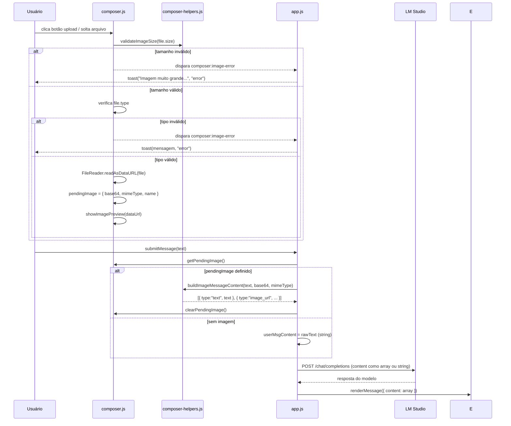

# Design Técnico — Multimodal (Visão)

## Visão Geral

Esta feature completa e formaliza o suporte a **mensagens multimodais com imagens** no Offline AI Chat. A infraestrutura parcial já existe — `composer-helpers.js` exporta `buildImageMessageContent` e `validateImageSize`, `composer.js` tem estado `pendingImage` e botão de upload, e `chat.js` já renderiza partes `image_url` em `setBodyContent`. O design consolida essas peças, adiciona drag-and-drop, detecção de VLMs, indicador visual de suporte e garante persistência correta no histórico.

O fluxo central é:

1. O usuário seleciona uma imagem via botão de upload ou drag-and-drop na área do chat.
2. O `Composer` valida tipo MIME e tamanho, lê o arquivo via `FileReader` e armazena em `pendingImage`.
3. Um `Image_Preview` é exibido acima da textarea com botão de remoção.
4. Ao enviar, o `App_Module` detecta `pendingImage`, chama `buildImageMessageContent` e constrói o `Multimodal_Content`.
5. O payload é enviado ao LM Studio com o array de partes (text + image_url).
6. O `Chat_Module` renderiza imagens no histórico a partir do `content` array.
7. A conversa é persistida com `content` como array, compatível com o schema existente.

### Escopo

- Upload via botão dedicado no composer (file picker nativo).
- Upload via drag-and-drop na área `#messages`.
- Preview com remoção antes do envio.
- Construção do payload OpenAI-compatible (`Multimodal_Content`).
- Renderização de imagens no histórico (já parcialmente implementada).
- Persistência de mensagens com `content` array.
- Detecção de VLMs via `isLikelyVisionModel` no `Model_Catalog`.
- Indicador visual no botão de upload quando o modelo não suporta visão.
- Validação de tipo MIME e tamanho no cliente.

---

## Arquitetura

### Diagrama de Módulos

```mermaid
graph TD
    A[app.js] -->|getPendingImage / clearPendingImage| B[composer.js]
    A -->|buildImageMessageContent| C[composer-helpers.js]
    A -->|isLikelyVisionModel| D[model-catalog.js]
    A -->|renderMessage / setBodyContent| E[chat.js]
    A -->|conversationStore.upsert| F[storage.js]
    B -->|validateImageSize| C
    B -->|handleImageFile| C
    G[Drop_Zone\n#messages] -->|dragover / drop| B
    H[File_Picker\ninput[type=file]] -->|change| B
    B -->|composer:image-error| A
    A -->|toast| I[toasts.js]
    D -->|isLikelyVisionModel| B
```

### Fluxo de Upload e Envio



---

## Componentes e Interfaces

### `modules/ui/composer-helpers.js` (existente — sem alterações)

Já exporta as duas funções puras necessárias:

```js
// Valida tamanho do arquivo (padrão: 10 MB)
export function validateImageSize(sizeBytes, limitBytes = 10 * 1024 * 1024)
  // → boolean

// Constrói Multimodal_Content OpenAI-compatible
export function buildImageMessageContent(text, base64Data, mimeType)
  // → [{ type: "text", text }, { type: "image_url", image_url: { url: "data:<mimeType>;base64,<base64Data>" } }]
```

Nenhuma alteração necessária — funções já implementadas e testadas.

### `modules/ui/composer.js` (existente — extensões)

Estado e funções já existentes que serão mantidos/completados:

```js
// Estado interno (já existe)
let pendingImage = null; // { base64, mimeType, name } | null

// Já exportadas
export function getPendingImage()     // → pendingImage | null
export function clearPendingImage()   // limpa pendingImage e remove Image_Preview do DOM
export function initComposer(opts)    // inicializa composer (adiciona botão de upload)
export function clearComposer()       // limpa textarea + clearPendingImage()
```

Funções internas a completar/ajustar:

```js
// Já existe — completar para aceitar drag-and-drop
function handleImageFile(file)
  // 1. Verifica file.type contra ALLOWED_TYPES
  // 2. Chama validateImageSize(file.size)
  // 3. Se inválido: dispara composer:image-error
  // 4. Se válido: FileReader.readAsDataURL → pendingImage → showImagePreview

// Já existe — manter comportamento atual
function showImagePreview(dataUrl)
  // Cria #composer-image-preview com  e botão de remoção

// Nova função: inicializa drag-and-drop na área de mensagens
function initDropZone(messagesElement)
  // Adiciona dragover, dragleave, drop listeners em messagesElement
  // dragover: exibe overlay se o arquivo for imagem
  // dragleave: remove overlay
  // drop: chama handleImageFile se for imagem; ignora silenciosamente se não for

// Nova função: atualiza estado visual do botão de upload
export function updateVisionIndicator(isVisionModel)
  // Adiciona/remove classe CSS "vision-warning" no botão de upload
  // Atualiza title/tooltip do botão
```

**Integração com `clearComposer`**: a função existente já chama `clearPendingImage()` implicitamente via o fluxo de envio. Garantir que `clearComposer` também chame `clearPendingImage()` explicitamente.

### `modules/model-catalog.js` (existente — nova função)

Adicionar função `isLikelyVisionModel`:

```js
// Detecta se um model ID/nome provavelmente suporta visão
export function isLikelyVisionModel(modelIdOrName)
  // → boolean
  // Padrões (case-insensitive):
  // gemma-?4, llava, bakllava, moondream, minicpm-?v, qwen-?vl,
  // internvl, phi-?3-?vision, pixtral, nemotron-?omni, vision, multimodal
```

Implementação:

```js
export function isLikelyVisionModel(modelIdOrName) {
  if (!modelIdOrName) return false;
  const s = modelIdOrName.toLowerCase();
  const patterns = [
    /gemma-?4/,
    /llava/,
    /bakllava/,
    /moondream/,
    /minicpm-?v/,
    /qwen-?vl/,
    /internvl/,
    /phi-?3-?vision/,
    /pixtral/,
    /nemotron-?omni/,
    /\bvision\b/,
    /multimodal/,
  ];
  return patterns.some((re) => re.test(s));
}
```

### `modules/ui/chat.js` (existente — já implementado)

A função `setBodyContent` já suporta `content` array:

```js
export function setBodyContent(body, content, streaming = false, reasoning = "")
  // Se content é Array: itera partes
  //   image_url → 
  //   text → renderMarkdown(text) ou <pre class="streaming"> se streaming
  // Se content é string: comportamento atual
```

Verificar que a implementação existente está completa e correta conforme os requisitos 4.1–4.6. Ajustes menores se necessário (ex: garantir `display: block` e `border-radius`).

### `app.js` (existente — extensões)

Funções já existentes que serão mantidas:

```js
// Já existe — mantido
const pendingImg = getPendingImage();
let userMsgContent;
if (pendingImg) {
  userMsgContent = buildImageMessageContent(rawText, pendingImg.base64, pendingImg.mimeType);
} else {
  userMsgContent = rawText;
}
```

Novas responsabilidades a adicionar em `app.js`:

```js
// 1. Escutar evento composer:image-error e exibir toast
document.addEventListener("composer:image-error", (e) => {
  toast(e.detail.message, "error");
});

// 2. Verificar modelo ativo e atualizar indicador visual no composer
function refreshVisionIndicator() {
  const profile = getActiveProfile();
  const model = profile?.defaultModel || "";
  const isVision = isLikelyVisionModel(model);
  updateVisionIndicator(isVision);
}
// Chamar em: loadModels(), refreshChips(), store.subscribe("activeProfileId")

// 3. Toast de aviso ao enviar imagem com modelo não-VLM
if (pendingImg && !isLikelyVisionModel(model)) {
  toast("O modelo selecionado pode não suportar imagens. A mensagem será enviada assim mesmo.", "warn", 5000);
}

// 4. Inicializar Drop_Zone após initChat
initDropZone(elements.messages);

// 5. Validação da data URL antes de incluir no payload
function isSafeImageDataUrl(url) {
  return typeof url === "string" && url.startsWith("data:image/");
}
```

### `modules/ui/chat.js` — Drop_Zone overlay

O overlay de drag-and-drop será um elemento criado dinamicamente dentro de `#messages`:

```js
// Criado por initDropZone em composer.js
const overlay = document.createElement("div");
overlay.id = "drop-zone-overlay";
overlay.className = "drop-zone-overlay";
overlay.setAttribute("role", "region");
overlay.setAttribute("aria-label", "Área para soltar imagem");
overlay.textContent = "Solte a imagem aqui";
```

---

## Modelos de Dados

### Estrutura de mensagem com imagem (histórico)

Mensagem `user` com imagem (salva no `conversationStore`):

```js
{
  role: "user",
  content: [
    { type: "text", text: "O que há nesta imagem?" },
    { type: "image_url", image_url: { url: "data:image/png;base64,<base64>" } }
  ],
  ts: 1234567890,
  id: "m-xxx-u"
}
```

Mensagem `user` sem imagem (comportamento atual — sem alteração):

```js
{
  role: "user",
  content: "Texto simples",
  ts: 1234567890,
  id: "m-xxx-u"
}
```

### Schema — compatibilidade com `content` array

O campo `content` em mensagens já aceita string ou array no código existente (`recomputeHistoryTokens` em `app.js` já trata ambos). Nenhuma migração de schema é necessária — o `conversationStore` persiste o objeto como JSON sem transformação.

Verificar em `recomputeHistoryTokens`:

```js
// Já existe — correto
const content = Array.isArray(m.content)
  ? m.content.filter((p) => p.type === "text").map((p) => p.text).join(" ")
  : (m.content || "");
total += estimateTokens(content);
```

### Estado do `pendingImage`

```js
// Tipo do estado interno em composer.js
pendingImage = {
  base64: string,    // dados base64 sem prefixo "data:mime;base64,"
  mimeType: string,  // "image/png" | "image/jpeg" | "image/gif" | "image/webp"
  name: string,      // nome original do arquivo
} | null
```

### CSS — novos seletores

Adicionar em `styles.css`:

```css
/* Image preview no composer */
.composer-image-preview { ... }
.composer-image-preview img { ... }
.composer-image-preview-remove { ... }

/* Drop zone overlay */
.drop-zone-overlay { ... }

/* Botão de upload com aviso de modelo não-VLM */
#imageUploadButton.vision-warning { ... }
#imageUploadButton.vision-warning svg { color: var(--warn); }
```

---

## Correctness Properties

*A property is a characteristic or behavior that should hold true across all valid executions of a system — essentially, a formal statement about what the system should do. Properties serve as the bridge between human-readable specifications and machine-verifiable correctness guarantees.*

### Property 1: Construção do Multimodal_Content

*Para qualquer* texto (incluindo string vazia) e qualquer combinação de `base64Data` e `mimeType` permitido, `buildImageMessageContent(text, base64Data, mimeType)` retorna um array de exatamente 2 elementos onde o primeiro é `{ type: "text", text }` e o segundo é `{ type: "image_url", image_url: { url: "data:<mimeType>;base64,<base64Data>" } }`.

**Validates: Requirements 3.1, 3.2, 3.3**

> Nota: Esta propriedade já é testada como Property 8 no arquivo `tests/feature-improvements.test.js`. A implementação em `composer-helpers.js` está completa. O teste deve ser estendido para cobrir `text = ""` (Requisito 3.3).

### Property 2: Validação de tamanho de arquivo

*Para qualquer* inteiro `sizeBytes` ≥ 0, `validateImageSize(sizeBytes)` retorna `true` se e somente se `sizeBytes <= 10 * 1024 * 1024`.

**Validates: Requirements 1.5, 7.1**

> Nota: Esta propriedade já é testada como Property 9 no arquivo `tests/feature-improvements.test.js`.

### Property 3: Validação combinada de tipo MIME e tamanho

*Para qualquer* par `(mimeType, sizeBytes)`, o arquivo é aceito pelo `Composer` se e somente se `mimeType` pertence ao conjunto `{ "image/png", "image/jpeg", "image/gif", "image/webp" }` E `sizeBytes <= 10 * 1024 * 1024`. Qualquer outra combinação resulta em rejeição.

**Validates: Requirements 1.4, 1.5, 7.6**

### Property 4: Detecção de VLM é case-insensitive

*Para qualquer* string `modelId` que contenha um dos padrões de visão conhecidos (gemma-4, llava, bakllava, moondream, minicpm-v, qwen-vl, internvl, phi-3-vision, pixtral, nemotron-omni, vision, multimodal) em qualquer combinação de maiúsculas e minúsculas, `isLikelyVisionModel(modelId)` retorna `true`. Para qualquer string que não contenha nenhum desses padrões, retorna `false`.

**Validates: Requirements 6.1, 6.5**

### Property 5: Segurança da data URL antes do envio

*Para qualquer* string `url`, a função `isSafeImageDataUrl(url)` retorna `true` se e somente se `url` é uma string que começa com `"data:image/"`. Apenas data URLs que passam nessa verificação são incluídas no `Image_Part` do payload.

**Validates: Requirements 7.4**

### Property 6: Renderização de imagens no histórico

*Para qualquer* `Multimodal_Content` (array com partes `image_url` e `text`), `setBodyContent(body, content)` produz elementos `` para cada `image_url` part com `src` igual à data URL, e elementos de texto para cada `text` part. O número de `` no DOM resultante é igual ao número de partes `image_url` no array.

**Validates: Requirements 4.1, 4.2, 4.3, 4.6**

### Property 7: Estimativa de tokens ignora Image_Parts

*Para qualquer* mensagem com `content` array, a estimativa de tokens calculada em `recomputeHistoryTokens` é igual à estimativa calculada apenas sobre os `Text_Parts` concatenados, sem considerar os `Image_Parts`.

**Validates: Requirements 5.4**

---

## Tratamento de Erros

### Erros de validação no cliente

| Situação | Comportamento |
|---|---|
| Tipo MIME não permitido | Dispara `composer:image-error` com mensagem descritiva → `app.js` exibe `toast(msg, "error")` |
| Arquivo > 10 MB | Dispara `composer:image-error` com `"Imagem muito grande. Limite: 10 MB."` → toast de erro |
| Erro no `FileReader` | Dispara `composer:image-error` com `"Erro ao ler imagem."` → toast de erro |
| Data URL inválida no payload | `isSafeImageDataUrl` retorna `false` → `Image_Part` descartado silenciosamente |

### Erros de UX

| Situação | Comportamento |
|---|---|
| Modelo não-VLM com imagem anexada | Toast de aviso `"O modelo selecionado pode não suportar imagens. A mensagem será enviada assim mesmo."` — envio prossegue |
| Arquivo não-imagem solto no Drop_Zone | Ignorado silenciosamente (drag-drop de workspace continua funcionando) |
| Envio com textarea vazia mas imagem presente | Permitido — `content` terá `Text_Part` com string vazia |

### Degradação graciosa

- Se o modelo não suporta visão (não-VLM), o payload é enviado normalmente — o modelo pode ignorar a imagem ou retornar erro, que será exibido como resposta do assistente.
- Se `pendingImage` for `null` ao enviar, o fluxo é idêntico ao atual — nenhuma regressão.
- Conversas antigas com `content` string continuam renderizando corretamente — `setBodyContent` trata ambos os casos.
- O drag-and-drop de imagens é independente do drag-and-drop de arquivos de workspace (`modules/workspace/dragdrop.js`) — cada handler verifica o tipo do arquivo antes de processar.

---

## Estratégia de Testes

### Abordagem dual

- **Testes de exemplo**: comportamentos específicos de UI, casos de borda, integrações.
- **Testes de propriedade** (fast-check): propriedades universais sobre validação, construção de payload e detecção de VLMs.

### Funções testáveis por propriedade (módulos puros, sem DOM)

Todas exportadas de módulos sem dependências de DOM:

- `validateImageSize(sizeBytes, limitBytes)` — `modules/ui/composer-helpers.js`
- `buildImageMessageContent(text, base64Data, mimeType)` — `modules/ui/composer-helpers.js`
- `isLikelyVisionModel(modelIdOrName)` — `modules/model-catalog.js`

### Arquivo de testes

Adicionar ao arquivo existente `tests/feature-improvements.test.js` (seguindo o padrão já estabelecido).

### Configuração de testes de propriedade

- Biblioteca: **fast-check** (já usada no projeto — `tests/package.json`)
- Mínimo de 100 iterações por propriedade (`numRuns: 100`)
- Tag de referência: `// Feature: multimodal-vision, Property N: <texto>`

### Cobertura por propriedade

| Property | Gerador fast-check | O que verifica |
|---|---|---|
| P1: buildImageMessageContent | `fc.string()` × `fc.string()` × `fc.constantFrom(mimeTypes)` | Estrutura do array, tipos, URL correta |
| P1 (extensão): texto vazio | `fc.constant("")` × `fc.string()` × `fc.constantFrom(mimeTypes)` | Text_Part com string vazia |
| P2: validateImageSize | `fc.integer({ min: 0, max: 20MB })` | Resultado === (size <= 10MB) |
| P3: validação combinada | `fc.string()` × `fc.integer({ min: 0, max: 20MB })` | Aceite iff tipo válido AND tamanho válido |
| P4: isLikelyVisionModel | Strings com padrões VLM em case aleatório + strings sem padrões | true iff contém padrão VLM |
| P5: isSafeImageDataUrl | `fc.string()` | true iff começa com "data:image/" |
| P6: setBodyContent com array | `fc.array(fc.oneof(imagePart, textPart))` | Número de img === número de image_url parts |
| P7: token estimation | `fc.array(fc.oneof(imagePart, textPart))` | Tokens === estimativa só dos text parts |

### Testes de exemplo (não-PBT)

- Botão de upload existe com `aria-label="Anexar imagem"`.
- File picker tem `accept="image/png,image/jpeg,image/gif,image/webp"`.
- `clearComposer()` limpa `pendingImage`.
- Modelo VLM → botão sem classe `vision-warning`.
- Modelo não-VLM → botão com classe `vision-warning`.
- Evento `composer:image-error` → `toast` chamado com `"error"`.
- Envio com imagem + modelo não-VLM → toast de aviso exibido.
- Conversa com `content` array carregada → imagens renderizadas corretamente.
- Arquivo não-imagem solto no Drop_Zone → `pendingImage` permanece `null`.
- `setBodyContent` com `streaming=true` e array → imagens imediatas, texto em `<pre class="streaming">`.
