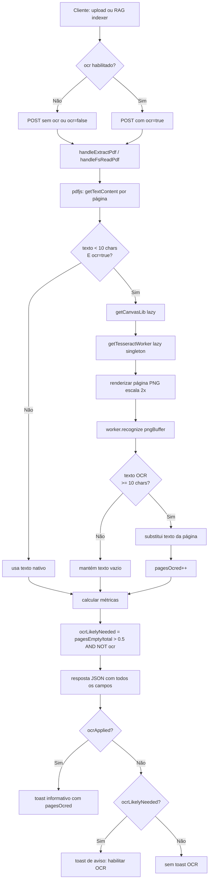

# Design Técnico — Suporte a OCR para PDFs Escaneados

## Visão Geral

Esta feature adiciona suporte a OCR automático para PDFs escaneados no **Offline AI Chat**, aproveitando as dependências `tesseract.js` e `@napi-rs/canvas` já presentes no servidor. O sistema detecta automaticamente quando um PDF não possui texto extraível e aplica OCR via Tesseract, sem exigir configuração manual do usuário além de um toggle nas preferências do workspace.

A feature cobre os dois fluxos de ingestão de PDF existentes:
- **Upload direto pelo cliente** (`/api/extract-pdf`) via `modules/workspace/upload.js`
- **Leitura via filesystem do servidor** (`/api/fs/read-pdf`) via `modules/workspace/fsbridge.js`

O design prioriza:
- **Transparência**: o usuário não precisa saber se um PDF é escaneado ou digital — o sistema detecta e age automaticamente.
- **Degradação graciosa**: se o OCR falhar em uma página, o processamento continua nas demais; se o OCR estiver desativado, o pipeline é idêntico ao atual.
- **Lazy loading**: o OCR engine (`tesseract.js` + `@napi-rs/canvas`) só é carregado quando uma requisição com `ocr: true` é recebida, mantendo o startup rápido.
- **Zero breaking changes**: toda a lógica nova é aditiva; chamadores existentes sem `ocr: true` continuam funcionando sem modificação.

### Pesquisa e Decisões de Design

**Dependências já presentes**: `tesseract.js` e `@napi-rs/canvas` já estão no `package.json` do projeto. Não há nova dependência a instalar.

**Heurística de detecção de PDF escaneado**: O threshold de 50% de páginas com menos de 10 caracteres é uma heurística conservadora. PDFs com mix de páginas digitais e escaneadas (ex: documentos com capa digital e corpo escaneado) são tratados como escaneados se a maioria das páginas não tiver texto. O threshold de 10 chars por página evita falsos positivos com páginas de separação ou rodapés.

**Escala 2.0 para renderização**: Renderizar a página em escala 2x antes de passar ao Tesseract melhora significativamente a acurácia do OCR em fontes pequenas, ao custo de maior uso de memória. É o tradeoff padrão recomendado pela documentação do Tesseract para documentos de escritório.

**Worker singleton com lazy init**: O worker do Tesseract é criado uma única vez e reutilizado entre requisições (enquanto os idiomas não mudam). Criar um worker por requisição seria proibitivo (~2-5s de overhead). O worker é inicializado apenas na primeira requisição com `ocr: true`.

**Cache de modelos em disco**: Os modelos de idioma do Tesseract (~10-20 MB por idioma) são baixados de CDN na primeira execução e armazenados em `OCR_CACHE_DIR` (padrão `/tmp/tesseract-cache`). Em deployments Docker, este diretório pode ser montado como volume para persistência entre reinicializações.

**Idiomas padrão `por+eng`**: O projeto é voltado para usuários brasileiros (português) com documentos frequentemente bilíngues. O padrão `por+eng` cobre a maioria dos casos sem configuração adicional.

---

## Arquitetura

O fluxo de processamento de PDF com OCR:

```
Cliente (browser)
  ├─ upload.js: extractPdfFile(file, { ocr: workspace.ocrEnabled })
  │    └─ POST /api/extract-pdf { dataBase64, name, ocr: true }
  │         └─ handleExtractPdf() → extractPdfPages(data, { ocr: true })
  │              ├─ pdfjs: getTextContent() por página
  │              ├─ [se texto < 10 chars e ocr=true] ocrPage(page, OCR_LANGS)
  │              │    ├─ getCanvasLib() [lazy]
  │              │    ├─ getTesseractWorker(langs) [lazy, singleton]
  │              │    └─ worker.recognize(pngBuffer) → text
  │              └─ resposta: { content, pagesEmpty, pagesWithText, pagesOcred, ocrApplied, ocrLikelyNeeded }
  │
  └─ fsbridge.js: fsReadPdf(root, path, { ocr: workspace.ocrEnabled })
       └─ POST /api/fs/read-pdf { sourceRoot, relPath, ocr: true }
            └─ handleFsReadPdf() → mesmo pipeline acima
```



### Módulos afetados

| Módulo | Mudança |
|---|---|
| `server.js` | Já implementado: `handleFsReadPdf` e `handleExtractPdf` com suporte a OCR, `ocrPage`, `getTesseractWorker`, `getCanvasLib`, `NodeCanvasFactory`, `OCR_LANGS` |
| `modules/workspace/upload.js` | Já implementado: `extractPdfFile` aceita `opts.ocr`, retorna `meta` com campos OCR |
| `modules/workspace/fsbridge.js` | Já implementado: `fsReadPdf` aceita `opts.ocr` |
| `modules/rag/indexer.js` | Já implementado: `readFile` passa `ocr: workspace.ocrEnabled`, coleta `ocrNeededFiles` e `ocredFiles` |
| `modules/schema.js` | Já implementado: `workspace.ocrEnabled: false` em `defaults()` |
| `modules/ui/settings/workspace.js` | Já implementado: checkbox OCR em `buildRagGlobalSection()` |
| `modules/ui/composer-helpers.js` ou `upload.js` | **Pendente**: toasts de feedback OCR após upload |

> **Nota**: A maior parte da implementação já existe no codebase. O design documenta a arquitetura completa e identifica as lacunas restantes.

---

## Componentes e Interfaces

### `server.js` — Pipeline de extração com OCR

O servidor já contém toda a lógica de OCR. Os dois handlers de PDF compartilham o mesmo pipeline interno:

**`handleExtractPdf(body, response)`** — recebe PDF em base64 do cliente:
```js
// body: { dataBase64: string, name: string, ocr: boolean }
// resposta: { content, pageCount, extractedPages, pagesWithText, pagesEmpty,
//             pagesOcred, ocrApplied, ocrLikelyNeeded, truncated }
```

**`handleFsReadPdf(body, response, request)`** — lê PDF do filesystem:
```js
// body: { sourceRoot: string, relPath: string, ocr: boolean }
// resposta: mesma estrutura acima + { size }
```

**`ocrPage(page, langs)`** — renderiza uma página pdfjs e aplica OCR:
```js
async function ocrPage(page, langs): Promise<string>
// Retorna texto reconhecido ou "" em caso de falha (nunca lança)
```

**`getTesseractWorker(langs)`** — singleton lazy do worker Tesseract:
```js
async function getTesseractWorker(langs: string[]): Promise<TesseractWorker>
// Reutiliza worker se langs não mudou; cria novo e termina o anterior se mudou
```

**`getCanvasLib()`** — singleton lazy do `@napi-rs/canvas`:
```js
async function getCanvasLib(): Promise<CanvasLib>
```

**`NodeCanvasFactory`** — adapter pdfjs para `@napi-rs/canvas`:
```js
class NodeCanvasFactory {
  create(width, height): { canvas, context }
  reset(canvasAndContext, width, height): void
  destroy(canvasAndContext): void
}
```

**Constante `OCR_LANGS`** — lida uma vez na inicialização:
```js
const OCR_LANGS = (process.env.OCR_LANGS || "por+eng")
  .split("+").map(s => s.trim()).filter(Boolean)
// Exemplo: ["por", "eng"] ou ["por", "eng", "spa"]
```

### `modules/workspace/upload.js` — Cliente de upload

**`extractPdfFile(file, opts)`** — já aceita `opts.ocr`:
```js
export async function extractPdfFile(file: File, opts = {}): Promise<FileObject>
// opts.ocr: boolean — passa ocr ao endpoint
// retorna: { path, name, size, content, meta: { kind, pageCount, extractedPages,
//            pagesWithText, pagesEmpty, pagesOcred, ocrApplied, ocrLikelyNeeded, truncated } }
```

**Toasts de feedback OCR** — a ser adicionado no chamador de `extractPdfFile`:
```js
// Após extractPdfFile retornar:
if (extracted.meta?.ocrApplied && extracted.meta?.pagesOcred > 0) {
  toast(`OCR aplicado em ${extracted.meta.pagesOcred} página(s) de "${file.name}".`, "info", 5000);
} else if (extracted.meta?.ocrApplied && extracted.meta?.pagesOcred === 0) {
  toast(`OCR aplicado em "${file.name}" mas nenhum texto foi reconhecido.`, "warn", 5000);
} else if (extracted.meta?.ocrLikelyNeeded) {
  toast(`"${file.name}" parece ser um PDF escaneado. Habilite OCR em Configurações → Workspace para extrair o texto.`, "warn", 6000);
}
```

### `modules/workspace/fsbridge.js` — Cliente de filesystem

**`fsReadPdf(sourceRoot, relPath, opts)`** — já aceita `opts.ocr`:
```js
export async function fsReadPdf(sourceRoot: string, relPath: string, opts = {}): Promise<PdfResult>
// opts.ocr: boolean
// retorna: { content, pageCount, extractedPages, pagesWithText, pagesEmpty,
//            pagesOcred, ocrApplied, ocrLikelyNeeded, truncated, size }
```

### `modules/rag/indexer.js` — Pipeline RAG

**`readFile(source, file, workspace)`** — já passa `ocr: workspace.ocrEnabled`:
```js
// Para source.kind === "server" com file.isPdf:
const r = await fsbridge.fsReadPdf(source.root, file.path, { ocr: !!workspace.ocrEnabled });
// Para source.kind === "fs-api" com file.isPdf:
const extracted = await extractPdfFile(f, { ocr: !!workspace.ocrEnabled });
```

O indexer já coleta `ocrNeededFiles` e `ocredFiles` durante a fase de leitura e os propaga no resultado final e nos eventos de progresso.

**Metadados de indexação com OCR** — `setSourceMeta` deve incluir informação sobre OCR:
```js
await setSourceMeta({
  sourceId: source.id,
  embeddingModel: embedConfig.model,
  embeddingDim: dim,
  chunkCount: allChunks.length,
  fileCount: files.length,
  indexedAt: Date.now(),
  ocrApplied: ocredFiles.length > 0,   // NOVO
  ocrNeededCount: ocrNeededFiles.length, // NOVO
});
```

### `modules/schema.js` — Schema de configuração

**`workspace.ocrEnabled`** — já presente em `defaults()`:
```js
workspace: {
  // ... campos existentes ...
  ocrEnabled: false,  // já implementado
}
```

**Soft migration** — para instalações existentes sem `ocrEnabled`:
```js
// Em loadAndMigrate(), após carregar o schema:
if (target.workspace && target.workspace.ocrEnabled === undefined) {
  target.workspace.ocrEnabled = false;
}
```

### `modules/ui/settings/workspace.js` — UI de configurações

O checkbox OCR já está implementado em `buildRagGlobalSection()`:
```js
ocrWrap.appendChild(checkbox(
  "OCR para PDFs escaneados (lento — ~10s por página na CPU)",
  !!ws.ocrEnabled,
  (v) => {
    const cur = store.get("workspace");
    store.set("workspace", { ...cur, ocrEnabled: v });
    onChange();
  },
));
```

---

## Modelos de Dados

### Resposta dos endpoints de PDF

```ts
interface PdfExtractionResponse {
  content: string;           // texto completo concatenado de todas as páginas
  pageCount: number;         // total de páginas no PDF
  extractedPages: number;    // páginas efetivamente processadas (max 500)
  pagesWithText: number;     // páginas com texto >= 10 chars após extração/OCR
  pagesEmpty: number;        // páginas com texto < 10 chars após extração/OCR
  pagesOcred: number;        // páginas onde OCR foi aplicado e retornou texto >= 10 chars
  ocrApplied: boolean;       // true se ocr=true foi passado na requisição
  ocrLikelyNeeded: boolean;  // true se !ocr E pagesEmpty/total > 0.5
  truncated: boolean;        // true se pageCount > 500
  size?: number;             // tamanho do arquivo em bytes (apenas /api/fs/read-pdf)
}
```

### Meta de arquivo no Upload_Backend

```ts
interface PdfFileMeta {
  kind: "pdf";
  pageCount: number;
  extractedPages: number;
  pagesWithText: number;
  pagesEmpty: number;
  pagesOcred: number;
  ocrApplied: boolean;
  ocrLikelyNeeded: boolean;
  truncated: boolean;
}
```

### Schema de workspace (localStorage)

```ts
interface WorkspaceConfig {
  sources: Source[];
  activeSourceId: string | null;
  ignorePatterns: string[];
  maxFileBytes: number;
  maxTotalBytes: number;
  autoIncludeOpenFiles: boolean;
  persistContext: boolean;
  ocrEnabled: boolean;  // default: false
}
```

### Metadados de fonte RAG (IndexedDB `embedding_meta`)

```ts
interface SourceMeta {
  sourceId: string;
  embeddingModel: string;
  embeddingDim: number;
  chunkCount: number;
  fileCount: number;
  indexedAt: number;
  ocrApplied?: boolean;      // NOVO: true se algum arquivo foi OCR'd
  ocrNeededCount?: number;   // NOVO: count de arquivos que precisavam de OCR mas não foram
}
```

### Variáveis de ambiente do servidor

| Variável | Padrão | Descrição |
|---|---|---|
| `OCR_LANGS` | `por+eng` | Idiomas do Tesseract separados por `+` |
| `OCR_CACHE_DIR` | `/tmp/tesseract-cache` | Diretório de cache dos modelos de idioma |

---

## Propriedades de Correção

*Uma propriedade é uma característica ou comportamento que deve ser verdadeiro em todas as execuções válidas de um sistema — essencialmente, uma afirmação formal sobre o que o sistema deve fazer. Propriedades servem como ponte entre especificações legíveis por humanos e garantias de correção verificáveis por máquina.*

### Propriedade 1: Threshold de detecção de PDF escaneado

*Para qualquer* array de textos de página (de comprimento arbitrário, incluindo zero), `ocrLikelyNeeded` deve ser `true` se e somente se `ocr` é `false` E a proporção de páginas com `text.trim().length < 10` é estritamente maior que 0.5.

**Valida: Requisitos 1.2, 1.3, 1.5**

### Propriedade 2: Invariante de campos na resposta de extração

*Para qualquer* requisição de extração de PDF (com ou sem OCR, com qualquer número de páginas), a resposta deve sempre conter os campos `pagesEmpty`, `pagesWithText`, `ocrLikelyNeeded` e `ocrApplied`, todos com tipos corretos (number/boolean).

**Valida: Requisito 1.4**

### Propriedade 3: Seleção correta de páginas para OCR

*Para qualquer* conjunto de páginas com textos de comprimento variado e `ocr=true`, o OCR deve ser invocado exatamente nas páginas onde `text.trim().length < 10`, e nunca nas páginas onde `text.trim().length >= 10`.

**Valida: Requisitos 2.1, 2.6**

### Propriedade 4: Substituição de texto por resultado OCR

*Para qualquer* página com texto nativo vazio e resultado OCR de comprimento variado, o texto final da página deve ser o texto OCR se `ocrText.length >= 10`, e deve permanecer vazio (ou o texto nativo original) se `ocrText.length < 10`.

**Valida: Requisito 2.2**

### Propriedade 5: Contagem correta de pagesOcred e ocrApplied

*Para qualquer* conjunto de páginas processadas com OCR, `pagesOcred` deve ser igual ao número de páginas onde OCR foi aplicado e retornou texto com `length >= 10`, e `ocrApplied` deve ser `true` se e somente se `pagesOcred > 0` ou `ocr=true` foi passado.

**Valida: Requisito 2.3**

### Propriedade 6: OCR nunca invocado quando ocr=false

*Para qualquer* conjunto de páginas (incluindo todas vazias) com `ocr=false`, a função `ocrPage` nunca deve ser chamada.

**Valida: Requisito 2.4**

### Propriedade 7: Resiliência a falhas de OCR por página

*Para qualquer* sequência de páginas onde um subconjunto aleatório falha no OCR (lança exceção), o resultado deve conter todas as páginas (com texto vazio para as que falharam), `ocrApplied` deve refletir se alguma página teve sucesso, e nenhuma exceção deve ser propagada para o cliente.

**Valida: Requisitos 2.5, 10.3**

### Propriedade 8: Parsing de OCR_LANGS

*Para qualquer* string de idiomas separados por `+` com 1 a N idiomas (incluindo espaços extras), o array resultante deve conter exatamente os idiomas não-vazios após trim, sem duplicatas de separadores.

**Valida: Requisito 3.3**

### Propriedade 9: Reutilização do worker Tesseract

*Para qualquer* sequência de chamadas a `getTesseractWorker` com os mesmos idiomas, todas as chamadas devem retornar a mesma instância de worker (referência idêntica). Para idiomas diferentes, deve retornar uma nova instância.

**Valida: Requisito 3.4**

### Propriedade 10: Mapeamento correto de resposta no Upload_Backend

*Para qualquer* resposta do servidor com valores arbitrários de `ocrApplied`, `ocrLikelyNeeded` e `pagesOcred`, o objeto `meta` retornado por `extractPdfFile` deve refletir exatamente esses valores com os tipos corretos (boolean/number).

**Valida: Requisitos 5.2, 5.3, 5.4**

### Propriedade 11: Propagação de ocrEnabled para requisições

*Para qualquer* valor de `workspace.ocrEnabled` (true ou false), o campo `ocr` enviado nas requisições a `/api/extract-pdf` e `/api/fs/read-pdf` deve ser exatamente `!!workspace.ocrEnabled`.

**Valida: Requisitos 5.1, 6.1, 9.1**

### Propriedade 12: Toasts de feedback com duração mínima

*Para qualquer* resultado de extração de PDF com `ocrLikelyNeeded=true` ou `ocrApplied=true`, o toast emitido deve ter `durationMs >= 5000`.

**Valida: Requisito 8.4**

### Propriedade 13: Limite de 500 páginas com OCR

*Para qualquer* PDF com `numPages` arbitrário (incluindo > 500), o número de páginas efetivamente processadas com OCR deve ser `min(numPages, 500)`.

**Valida: Requisito 10.2**

### Propriedade 14: Lazy loading do OCR engine

*Para qualquer* sequência de requisições com `ocr=false`, as funções `getCanvasLib` e `getTesseractWorker` nunca devem ser chamadas.

**Valida: Requisito 10.4**

---

## Tratamento de Erros

### Falha de OCR em página individual

Quando `ocrPage` lança exceção (falha de renderização canvas, timeout do Tesseract, memória insuficiente):
- A exceção é capturada dentro do loop de páginas.
- `console.warn(`OCR failed: ${err.message}`)` é registrado.
- A página recebe texto vazio (não incrementa `pagesOcred`).
- O processamento continua nas páginas restantes.
- A resposta final é retornada normalmente com os dados das páginas bem-sucedidas.

### Worker Tesseract não inicializado

Quando `getTesseractWorker` falha (modelo não encontrado, CDN inacessível, permissão de disco):
- A exceção propaga para `ocrPage`, que a captura e retorna `""`.
- O comportamento é idêntico à falha de OCR por página.
- Em deployments offline sem cache pré-populado, todas as páginas OCR retornam vazio.

### PDF excede limite de tamanho

A validação de `MAX_PDF_BYTES` (32 MB) ocorre antes de qualquer processamento de texto ou OCR. PDFs acima do limite recebem HTTP 413 antes de chegar ao pipeline de extração.

### Diretório de cache inexistente

`getTesseractWorker` cria o diretório `OCR_CACHE_DIR` com `mkdir({ recursive: true })` antes de inicializar o worker. Falhas de permissão de disco são propagadas como erro de inicialização do worker, tratado como falha de OCR por página.

### Requisição abortada durante OCR

O Tesseract.js não suporta abort nativo por página. Se a requisição HTTP for encerrada pelo cliente durante o OCR, o servidor completa o processamento da página atual e descarta o resultado. Não há vazamento de recursos — o worker singleton continua disponível para requisições futuras.

### Mudança de idiomas entre requisições

Quando `OCR_LANGS` muda (reinicialização do servidor com nova variável de ambiente), `getTesseractWorker` detecta a mudança pela comparação de `tesseractWorkerLangs`, chama `terminate()` no worker anterior e cria um novo. O novo worker baixa os modelos dos novos idiomas se não estiverem em cache.

---

## Estratégia de Testes

### Testes unitários (example-based)

Cobrem comportamentos específicos e casos de borda:

**`server.js` — lógica de extração:**
- `ocrLikelyNeeded` é `false` quando `ocr=true` (mesmo que todas as páginas sejam vazias).
- `ocrLikelyNeeded` é `false` quando `pagesEmpty === 0`.
- `ocrLikelyNeeded` é `false` quando `numPages === 0`.
- `pagesOcred` é 0 quando nenhuma página tem texto OCR com `length >= 10`.
- `ocrApplied` é `true` quando `ocr=true` foi passado, independente de `pagesOcred`.

**`modules/workspace/upload.js`:**
- `extractPdfFile` com `opts.ocr=true` inclui `ocr: true` no body da requisição.
- `extractPdfFile` sem `opts` inclui `ocr: false` no body.
- Meta retornada contém todos os campos esperados mesmo quando servidor retorna valores ausentes.

**`modules/schema.js`:**
- `defaults()` retorna `workspace.ocrEnabled: false`.
- Soft migration adiciona `ocrEnabled: false` em schemas sem o campo.

**`modules/ui/settings/workspace.js`:**
- Checkbox OCR está presente no DOM após `buildRagGlobalSection()`.
- Checkbox reflete `ws.ocrEnabled` inicial.
- Callback do checkbox chama `store.set` com o valor correto.

### Testes de propriedade (property-based com fast-check)

O projeto já usa `fast-check` em `tests/feature-improvements.test.js`. Cada propriedade listada acima é implementada como um teste PBT com mínimo 100 iterações.

**Tag de referência**: cada teste referencia a propriedade do design:
```js
// Feature: pdf-ocr-support, Property 1: threshold de detecção de PDF escaneado
```

**Geradores relevantes:**
```js
// Array de textos de página com comprimentos variados
fc.array(fc.string({ maxLength: 200 }), { minLength: 0, maxLength: 50 })

// Proporção de páginas vazias (para testar threshold)
fc.integer({ min: 0, max: 100 }).map(pct => ({
  pages: Array.from({ length: 10 }, (_, i) => i < pct / 10 ? "" : "texto suficiente aqui"),
  pct
}))

// Texto OCR de comprimento variado (para testar substituição)
fc.string({ maxLength: 500 })

// Configuração de idiomas
fc.array(fc.string({ minLength: 2, maxLength: 5 }), { minLength: 1, maxLength: 5 })
  .map(langs => langs.join("+"))

// Resposta do servidor com campos OCR variados
fc.record({
  ocrApplied: fc.boolean(),
  ocrLikelyNeeded: fc.boolean(),
  pagesOcred: fc.integer({ min: 0, max: 100 }),
  pagesEmpty: fc.integer({ min: 0, max: 100 }),
  pagesWithText: fc.integer({ min: 0, max: 100 }),
})
```

**Mocks necessários:**
- `ocrPage` é mockado nos testes de propriedade para retornar textos gerados pelo fast-check, evitando dependência do Tesseract.
- `fetch` é mockado nos testes de `upload.js` para retornar respostas geradas pelo fast-check.
- `getTesseractWorker` é mockado para retornar um objeto com `recognize` mockado.

### Testes de integração (smoke)

- Verificar que o servidor inicia sem erros quando `OCR_LANGS` não está definida.
- Verificar que `/api/extract-pdf` com `ocr: false` retorna os 4 campos obrigatórios.
- Verificar que `/api/fs/read-pdf` com `ocr: false` retorna os 4 campos obrigatórios.
- Verificar que PDFs acima de `MAX_PDF_BYTES` retornam HTTP 413 antes de qualquer OCR.

### Testes manuais recomendados

1. Fazer upload de um PDF escaneado com OCR desativado — verificar toast de aviso sugerindo habilitar OCR.
2. Ativar OCR nas configurações do workspace e fazer upload do mesmo PDF — verificar toast informativo com número de páginas OCR'd.
3. Fazer upload de um PDF digital (com texto nativo) com OCR ativado — verificar que nenhum toast OCR é exibido e que o texto é extraído normalmente.
4. Indexar uma fonte RAG com PDFs escaneados e OCR ativado — verificar que os chunks contêm texto reconhecido.
5. Verificar que o servidor inicia rapidamente (`node server.js`) sem carregar o Tesseract até a primeira requisição com `ocr: true`.
6. Em ambiente Docker sem acesso à CDN do Tesseract, verificar que o OCR falha graciosamente (páginas retornam vazias, sem crash do servidor).
