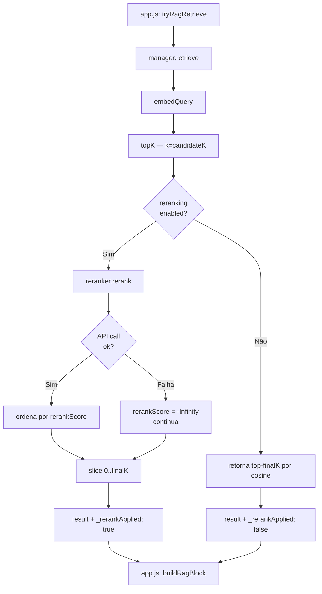

# Design Técnico — Reranking com Cross-Encoder no RAG

## Visão Geral

Esta feature adiciona uma etapa de **reranking** ao pipeline RAG do Offline AI Chat, implementando o padrão **retrieve-then-rerank** da indústria. O bi-encoder existente (`embedder.js`) continua responsável pela recuperação inicial eficiente via cosine similarity, mas agora um cross-encoder pode reordenar o conjunto candidato com scores de relevância muito mais precisos antes de enviar os chunks ao LLM.

O design prioriza:
- **Degradação graciosa**: se o reranker falhar ou estiver desativado, o pipeline continua idêntico ao atual.
- **Isolamento**: toda a lógica de cross-encoder fica em `modules/rag/reranker.js`, sem contaminar módulos existentes.
- **Zero breaking changes**: a assinatura de `manager.retrieve()` é estendida com parâmetros opcionais; chamadores existentes em `app.js` continuam funcionando sem modificação.
- **Compatibilidade com estratégias existentes**: `exhaustive`, `comparative`, `summary` e `point` são tratadas corretamente.

### Pesquisa e Decisões de Design

**Cross-encoder via API OpenAI-compatible**: O LM Studio expõe modelos de cross-encoder (ex: `cross-encoder/ms-marco-MiniLM-L-6-v2`) via `/v1/chat/completions`. A abordagem padrão é enviar o par `(query, chunk)` como prompt e extrair um score numérico da resposta. Modelos como `ms-marco-MiniLM-L-6-v2` são treinados para retornar um logit de relevância, mas via API de chat o score é extraído do conteúdo textual da resposta.

**Decisão: prompt de scoring via chat/completions**: Como o LM Studio não expõe um endpoint dedicado de reranking (tipo Cohere `/v1/rerank`), usamos `/v1/chat/completions` com um prompt estruturado que pede ao modelo um score numérico de 0-10. Isso é compatível com qualquer modelo de cross-encoder carregado no LM Studio.

**Decisão: processamento sequencial de lotes**: O LM Studio processa um modelo por vez. Paralelizar chamadas causaria enfileiramento interno e não reduziria latência. Lotes sequenciais são mais previsíveis e respeitam o modelo de execução do LM Studio.

**Decisão: truncamento a 2048 chars**: Cross-encoders têm context window limitado (tipicamente 512 tokens). A estimativa de 4 chars/token é conservadora e evita overflow sem precisar de tokenização real no browser.

**Decisão: `_rerankApplied` no resultado**: Permite que `app.js` e o RAG Pill saibam se o reranking foi efetivamente executado, sem precisar re-checar a config. Útil para o indicador visual e para debug.

---

## Arquitetura

O pipeline RAG após esta feature:

```
app.js
  └─ tryRagRetrieve()
       └─ manager.retrieve()
            ├─ [existente] embedQuery()          → queryVec
            ├─ [existente] topK()                → candidateSet (k = candidateK)
            ├─ [NOVO] reranker.rerank()           → rerankedChunks (se enabled)
            │    ├─ truncate texts to 2048 chars
            │    ├─ batch pairs (query, chunk)
            │    └─ call /v1/chat/completions sequentially
            └─ slice(0, finalK)                  → result (com _rerankApplied)
```



### Módulos afetados

| Módulo | Mudança |
|---|---|
| `modules/rag/reranker.js` | **Novo** — lógica de cross-encoder |
| `modules/rag/manager.js` | Estendido — chama reranker pós-retrieval |
| `modules/schema.js` | Estendido — `rag.reranking` em `defaults()` + soft migration |
| `modules/ui/settings/workspace.js` | Estendido — seção de reranking no painel RAG |
| `app.js` | Estendido — `refreshRagPill()` exibe sufixo `+ rerank` |

---

## Componentes e Interfaces

### `modules/rag/reranker.js` (novo)

```js
/**
 * Rerank a candidate set using a cross-encoder model.
 *
 * @param {object} opts
 * @param {string} opts.query          - User query
 * @param {Array}  opts.chunks         - Candidate chunks from retriever
 * @param {object} opts.config         - Reranking config (rerankModel, rerankEndpoint,
 *                                       rerankBatchSize, candidateK, finalK)
 * @param {object} opts.embedConfig    - Connection info (baseUrl, apiKey)
 * @param {AbortSignal} [opts.signal]  - Abort signal
 * @returns {Promise<Array>}           - Same chunks, sorted by rerankScore desc,
 *                                       each with added `rerankScore` field
 */
export async function rerank({ query, chunks, config, embedConfig, signal })
```

Responsabilidades internas:
- Truncar `chunk.text` a 2048 chars antes de enviar.
- Construir prompt de scoring: `"Relevance score (0-10) for query: '{query}'\nDocument: '{text}'\nScore:"`.
- Enviar em lotes de `config.rerankBatchSize` (padrão 8), sequencialmente.
- Parsear o score numérico da resposta; atribuir `-Infinity` em caso de falha.
- Preservar todos os campos originais do chunk; adicionar `rerankScore`.
- Ordenar por `rerankScore` desc, desempate por `score` (cosine) desc.
- Respeitar `signal` de abort — lançar `Error("Reranking cancelado")` se abortado.

### `modules/rag/manager.js` (estendido)

A função `retrieve()` recebe dois novos parâmetros opcionais:

```js
export async function retrieve({
  sourceId,
  query,
  embedConfig,
  k = 5,
  maxPerFile = 0,
  includeFirstPerFile = false,
  coverAllFiles = false,
  exhaustive = false,
  charBudget = 100000,
  // NOVOS:
  rerankConfig = null,   // objeto rag.reranking ou null
  signal = null,         // AbortSignal
})
```

Lógica adicionada após `topK()`:

```
if (rerankConfig?.enabled && rerankConfig?.rerankModel && !wasExhaustive) {
  try {
    const reranked = await reranker.rerank({ query, chunks: candidates, config: rerankConfig, embedConfig, signal })
    return { chunks: reranked.slice(0, rerankConfig.finalK), _rerankApplied: true }
  } catch (err) {
    console.error('[RAG] Reranking falhou:', err.message)
    toast(`Reranking falhou: ${err.message}. Usando ordem original.`, 'warn')
    return { chunks: candidates.slice(0, rerankConfig.finalK || k), _rerankApplied: false }
  }
}
return { chunks: candidates, _rerankApplied: false }
```

**Nota sobre `comparative` + `coverAllFiles`**: quando `coverAllFiles: true`, o reranking é aplicado apenas sobre os chunks que excedem a cota mínima (1 por arquivo). Os chunks de cobertura mínima são preservados independentemente do `rerankScore`.

**Nota sobre `exhaustive`**: quando o índice inteiro cabe no `charBudget`, o reranking é ignorado — todos os chunks já são incluídos, não há o que reordenar.

O retorno de `retrieve()` muda de `Array` para `{ chunks: Array, _rerankApplied: boolean }`. O chamador em `app.js` (`tryRagRetrieve`) precisa ser atualizado para desestruturar o resultado.

### `modules/schema.js` (estendido)

Adição em `defaults()`:

```js
rag: {
  // ... campos existentes ...
  reranking: {
    enabled: false,
    rerankModel: "",
    rerankEndpoint: "",
    candidateK: 20,
    finalK: 5,
    rerankBatchSize: 8,
  },
},
```

Soft migration em `loadAndMigrate()`:

```js
// Soft migration: add rag.reranking if absent
if (target.rag && !target.rag.reranking) {
  target.rag.reranking = defaults().rag.reranking;
}
// Validate finalK <= candidateK
if (target.rag?.reranking) {
  const r = target.rag.reranking;
  if (r.finalK > r.candidateK) {
    r.candidateK = r.finalK * 3;
  }
}
```

### `modules/ui/settings/workspace.js` (estendido)

Nova função `buildRerankingSection()` adicionada dentro de `buildRagGlobalSection()`, após o bloco de configurações avançadas existente. Renderiza:

1. Checkbox "Ativar reranking" → `rag.reranking.enabled`
2. Quando enabled=true:
   - Campo texto "Modelo cross-encoder" → `rag.reranking.rerankModel`
   - Campo texto "Endpoint do reranker (opcional)" → `rag.reranking.rerankEndpoint`
   - Slider/number "Candidatos para reranking" (5–50) → `rag.reranking.candidateK`
   - Slider/number "Chunks finais após reranking" (1–20) → `rag.reranking.finalK`
   - Validação inline: se `finalK > candidateK`, exibe mensagem e desabilita save
   - Nota informativa estática sobre cross-encoder vs embedding model

### `app.js` — `refreshRagPill()` (estendido)

A função `refreshRagPill()` existente é estendida para incluir o sufixo `+ rerank` quando `rag.reranking.enabled === true && rag.reranking.rerankModel !== ""`.

O campo `_rerankApplied` do último resultado é armazenado em `runtime.lastRerankApplied` para que o pill possa exibir o estado de falha (`+ rerank ⚠`).

---

## Modelos de Dados

### `rag.reranking` (novo sub-objeto no schema)

```ts
interface RerankingConfig {
  enabled: boolean;          // default: false
  rerankModel: string;       // ex: "cross-encoder/ms-marco-MiniLM-L-6-v2", default: ""
  rerankEndpoint: string;    // URL base alternativa; default: "" (usa servidor ativo)
  candidateK: number;        // tamanho do candidate set; default: 20
  finalK: number;            // chunks enviados ao LLM após reranking; default: 5
  rerankBatchSize: number;   // pares por requisição ao cross-encoder; default: 8
}
```

Invariante: `finalK <= candidateK`. Violações são corrigidas na soft migration (`candidateK = finalK * 3`).

### Chunk com `rerankScore` (extensão do tipo existente)

```ts
interface RankedChunk {
  // campos existentes do retriever:
  id: string;
  sourceId: string;
  fileId: string;
  path: string;
  chunkIdx: number;
  text: string;
  lineStart: number;
  lineEnd: number;
  score: number;          // cosine similarity (bi-encoder)
  _reason?: string;       // "first-chunk" | "all-files-coverage" | "exhaustive"
  vec: Float32Array;
  // campo adicionado pelo reranker:
  rerankScore?: number;   // score do cross-encoder; -Infinity em caso de falha
}
```

### Retorno de `manager.retrieve()` (mudança de contrato)

```ts
interface RetrieveResult {
  chunks: RankedChunk[];
  _rerankApplied: boolean;
}
```

---

## Propriedades de Correção

*Uma propriedade é uma característica ou comportamento que deve ser verdadeiro em todas as execuções válidas de um sistema — essencialmente, uma afirmação formal sobre o que o sistema deve fazer. Propriedades servem como ponte entre especificações legíveis por humanos e garantias de correção verificáveis por máquina.*

### Propriedade 1: Completude do reranker

*Para qualquer* Candidate_Set de entrada com N chunks, o reranker SHALL retornar exatamente N chunks na saída — nenhum chunk é descartado, apenas reordenado.

**Valida: Requisito 1.8**

### Propriedade 2: Ordenação por rerankScore com desempate

*Para qualquer* conjunto de chunks com rerankScores e scores (cosine) arbitrários, o array retornado pelo reranker deve estar ordenado por `rerankScore` decrescente, com empates resolvidos por `score` decrescente.

**Valida: Requisitos 1.1, 1.7**

### Propriedade 3: Preservação de campos originais

*Para qualquer* chunk com campos arbitrários (`id`, `path`, `text`, `score`, `_reason`, etc.), após o reranking todos os campos originais devem estar presentes no objeto de saída correspondente, com o campo `rerankScore` adicionado.

**Valida: Requisito 1.4**

### Propriedade 4: Truncamento de texto antes do cross-encoder

*Para qualquer* chunk com texto de comprimento arbitrário, o texto enviado ao cross-encoder nunca deve exceder 2048 caracteres.

**Valida: Requisito 1.3**

### Propriedade 5: Degradação graciosa — chunks com falha recebem -Infinity

*Para qualquer* chunk para o qual o cross-encoder retorna erro HTTP ou resposta malformada, o `rerankScore` atribuído deve ser `-Infinity`, e os demais chunks do mesmo lote devem continuar sendo processados normalmente.

**Valida: Requisito 1.6**

### Propriedade 6: Tamanho do resultado final

*Para qualquer* estratégia onde reranking é aplicado e qualquer tamanho de Candidate_Set, o número de chunks no resultado final deve ser igual a `min(reranking.finalK, tamanho do Candidate_Set)`.

**Valida: Requisitos 3.3, 7.5**

### Propriedade 7: Fallback preserva resultados originais

*Para qualquer* falha do reranker (exceção de rede, timeout, modelo não carregado), o manager deve retornar os chunks originais do retriever sem modificação, com `_rerankApplied: false`.

**Valida: Requisito 3.5**

### Propriedade 8: `_rerankApplied` sempre presente

*Para qualquer* chamada a `manager.retrieve()`, o resultado deve sempre incluir o campo `_rerankApplied` como boolean, independentemente de o reranking estar habilitado ou não.

**Valida: Requisito 3.6**

### Propriedade 9: Soft migration adiciona reranking ausente

*Para qualquer* configuração existente sem o campo `rag.reranking`, após `loadAndMigrate()` o campo deve estar presente com todos os valores padrão, sem sobrescrever os demais campos de `rag`.

**Valida: Requisito 4.3**

### Propriedade 10: Correção de invariante finalK ≤ candidateK

*Para qualquer* configuração onde `reranking.finalK > reranking.candidateK`, após a soft migration `candidateK` deve ser ajustado para `finalK * 3`.

**Valida: Requisito 4.4**

### Propriedade 11: Round-trip de serialização JSON do config de reranking

*Para qualquer* objeto `rag.reranking` válido, `JSON.parse(JSON.stringify(cfg))` deve produzir um objeto profundamente equivalente ao original.

**Valida: Requisito 4.5**

### Propriedade 12: candidateK efetivo quando não definido

*Para qualquer* valor de `finalK`, quando `candidateK` não está definido ou é menor que `finalK`, o `candidateK` efetivo usado pelo reranker deve ser `finalK * 3`.

**Valida: Requisito 2.5**

### Propriedade 13: Validação de UI — finalK ≤ candidateK

*Para qualquer* par `(finalK, candidateK)` onde `finalK > candidateK`, a validação do painel de settings deve retornar um erro e impedir o save.

**Valida: Requisito 5.6**

### Propriedade 14: RAG Pill sem sufixo quando reranking desabilitado

*Para qualquer* estado do sistema quando `rag.reranking.enabled === false`, o label do RAG Pill nunca deve conter a substring `"rerank"`.

**Valida: Requisito 6.3**

---

## Tratamento de Erros

### Falha do cross-encoder por chunk

Quando o endpoint retorna erro HTTP (4xx, 5xx) ou resposta não parseável para um chunk específico:
- `rerankScore` do chunk é definido como `-Infinity`.
- O processamento dos demais chunks continua normalmente.
- Nenhuma exceção é propagada para o manager.
- O chunk com `-Infinity` ficará no final da lista ordenada.

### Falha total do reranker

Quando o reranker lança exceção (rede inacessível, modelo não carregado, abort):
- O manager captura a exceção.
- Emite `toast("Reranking falhou: <motivo>. Usando ordem original.", "warn")`.
- Retorna os chunks do retriever original (sem reranking), com `_rerankApplied: false`.
- O pipeline continua normalmente — o LLM recebe os chunks por cosine similarity.

### Abort durante reranking

Quando `signal.aborted` é detectado durante o loop de lotes:
- O reranker lança `Error("Reranking cancelado")`.
- O manager trata como falha total (fallback para ordem original).
- Nenhum toast de erro é exibido para cancelamentos explícitos do usuário.

### Modelo não carregado no LM Studio

O LM Studio retorna HTTP 400 ou 503 quando nenhum modelo está carregado. O reranker trata como falha por chunk (score `-Infinity`) ou falha total dependendo de onde ocorre. O toast de aviso orienta o usuário a carregar o modelo cross-encoder.

### Mismatch de endpoint

Quando `rerankEndpoint` está definido mas inacessível, o erro é tratado como falha total com fallback. O usuário vê o toast de aviso e pode corrigir o endpoint nas configurações.

---

## Estratégia de Testes

### Testes unitários (exemplo-based)

Cobrem comportamentos específicos e casos de borda:

- `reranker.js`: abort signal lança `"Reranking cancelado"`, batchSize padrão 8 quando não definido, processamento sequencial de lotes.
- `manager.js`: reranker não é chamado quando `enabled=false` ou `rerankModel=""`, reranker não é chamado em modo `exhaustive`, signal é propagado para o reranker.
- `schema.js`: `defaults()` retorna `rag.reranking` com todos os campos e tipos corretos.
- `workspace.js` (settings): seção de reranking existe no DOM, campos ficam ocultos quando `enabled=false`.
- `app.js` (`refreshRagPill`): sufixo `+ rerank` aparece quando configurado, sufixo `+ rerank ⚠` aparece quando `_rerankApplied=false` com reranking habilitado.

### Testes de propriedade (property-based com fast-check)

Cada propriedade listada na seção anterior é implementada como um teste PBT com mínimo 100 iterações. O módulo `fast-check` já é usado no projeto (`tests/feature-improvements.test.js`).

**Configuração de tag**: cada teste referencia a propriedade do design:
```js
// Feature: rag-reranking, Property 1: completude do reranker
runProperty("Property 1: reranker output size equals input size", ...)
```

**Mocks necessários**: as chamadas ao cross-encoder são mockadas nos testes de propriedade para evitar dependência de LM Studio. O mock retorna scores aleatórios gerados pelo fast-check.

**Geradores relevantes**:
- `fc.array(chunkArbitrary, { minLength: 0, maxLength: 30 })` — candidate sets de tamanho variável
- `fc.record({ rerankScore: fc.float(), score: fc.float() })` — chunks com scores arbitrários
- `fc.string({ maxLength: 5000 })` — textos de chunk de comprimento variável (para testar truncamento)
- `fc.record({ enabled: fc.boolean(), rerankModel: fc.string(), finalK: fc.integer({min:1,max:20}), candidateK: fc.integer({min:1,max:50}) })` — configs de reranking

### Testes de integração (smoke)

- Verificar que `console.log` é chamado com tempo de execução quando `debugMode=true`.
- Verificar que `console.log` registra top-3 chunks antes/depois quando `debugMode=true` e reranking aplicado.

### Testes manuais recomendados

1. Carregar um modelo cross-encoder no LM Studio (ex: `cross-encoder/ms-marco-MiniLM-L-6-v2`).
2. Indexar uma fonte com múltiplos documentos.
3. Ativar reranking nas configurações, definir o modelo.
4. Fazer uma pergunta pontual e verificar que o RAG Pill exibe `"RAG · N chunks + rerank"`.
5. Descarregar o modelo cross-encoder e fazer outra pergunta — verificar toast de aviso e que a resposta ainda funciona com cosine similarity.
6. Verificar que `Ctrl+Shift+R` após mudanças no client atualiza o service worker.
