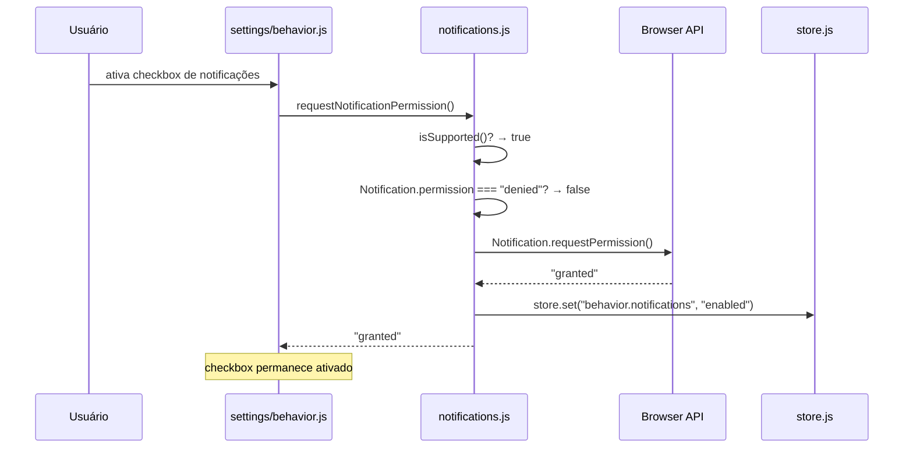
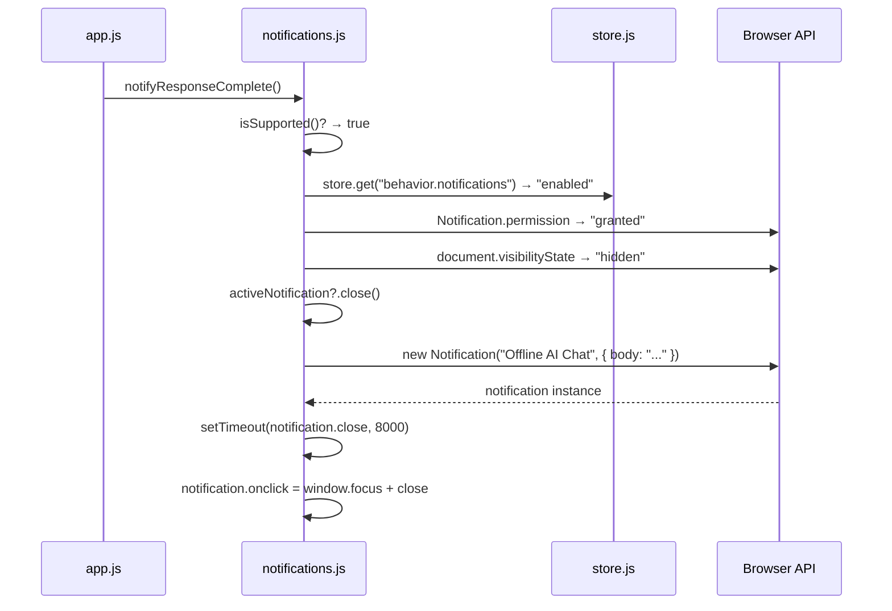
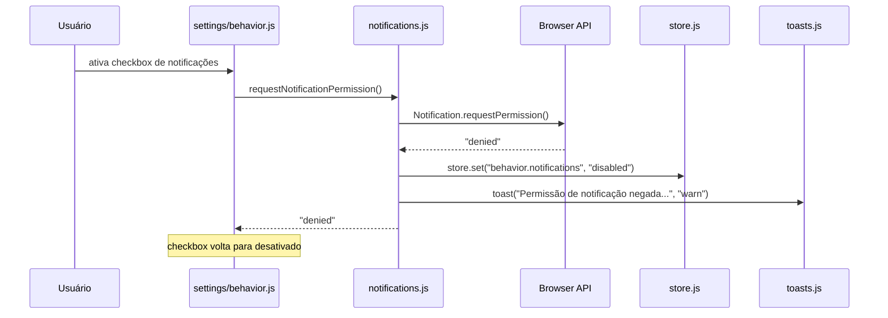

# Design Técnico — Notificações de Resposta

## Visão Geral

Esta feature adiciona suporte a **notificações do sistema operacional** ao Offline AI Chat, alertando o usuário quando o modelo terminar de gerar uma resposta enquanto a aba está em segundo plano. O mecanismo é a **Web Notifications API** nativa do browser — sem dependências externas, sem servidor, sem transmissão de dados de conversa.

O design segue os princípios do projeto: vanilla JS, ES modules nativos, zero deps no client, estado reativo via `store.js`, persistência via `schema.js`.

O fluxo central é:

1. O módulo `modules/notifications.js` encapsula toda a lógica de permissão, disparo e ciclo de vida das notificações.
2. O painel "Comportamento" em `modules/ui/settings/behavior.js` expõe um checkbox opt-in, visível apenas quando o browser suporta a API.
3. Quando `finalizeAssistant` é chamado em `modules/ui/chat.js`, `app.js` invoca `notifyResponseComplete()` do módulo de notificações.
4. O módulo verifica as três condições necessárias (aba oculta + permissão concedida + notificações ativas) antes de criar qualquer `Notification`.
5. A preferência é persistida em `behavior.notifications` no schema existente.

### Escopo

- Novo módulo `modules/notifications.js` com toda a lógica de notificação.
- Modificação em `modules/schema.js`: adicionar `behavior.notifications` com valor padrão `"disabled"`.
- Modificação em `modules/ui/settings/behavior.js`: adicionar checkbox de notificações.
- Modificação em `app.js`: importar o módulo e chamar `notifyResponseComplete()` após `finalizeAssistant`.
- Nenhum novo endpoint em `server.js` — a feature é 100% client-side.

---

## Arquitetura

### Diagrama de Módulos

```mermaid
graph TD
    A[app.js] -->|notifyResponseComplete| B[notifications.js\nmodules/notifications.js]
    A -->|initNotifications| B
    B -->|Notification.requestPermission| C[Web Notifications API\n(browser)]
    B -->|store.get / store.set| D[store.js]
    B -->|toast| E[toasts.js]
    F[settings/behavior.js] -->|requestNotificationPermission\nisSupported / isBlocked| B
    F -->|store.set behavior.notifications| D
    D -->|debouncedPersist| G[localStorage\noffline-ai-chat:v2]
    H[schema.js] -->|defaults: behavior.notifications = disabled| D
```

### Fluxo de Ativação (primeira vez)



### Fluxo de Disparo de Notificação



### Fluxo de Permissão Negada



---

## Componentes e Interfaces

### `modules/notifications.js` (novo módulo)

Módulo ES puro. Exporta funções puras para testabilidade e funções com efeitos colaterais para integração.

```js
// ── Funções puras (exportadas para testes) ──────────────────────────────────

/**
 * Verifica se o browser suporta a Web Notifications API.
 * Retorna false se "Notification" não estiver em window ou se
 * Notification.requestPermission não for uma função.
 *
 * @returns {boolean}
 */
export function isSupported()

/**
 * Verifica se a permissão de notificação está bloqueada pelo browser.
 * Retorna true apenas quando Notification.permission === "denied".
 * Retorna false se a API não for suportada.
 *
 * @returns {boolean}
 */
export function isBlocked()

/**
 * Determina se uma notificação deve ser disparada com base nas três condições.
 * Função pura — recebe os valores como parâmetros, sem acessar globals.
 *
 * @param {string} visibilityState - document.visibilityState ("hidden" | "visible" | ...)
 * @param {string} permission      - Notification.permission ("granted" | "denied" | "default")
 * @param {string} notificationsPref - store behavior.notifications ("enabled" | "disabled")
 * @returns {boolean}
 */
export function shouldNotify(visibilityState, permission, notificationsPref)

// ── Funções com efeitos colaterais ──────────────────────────────────────────

/**
 * Inicializa o módulo com referências ao store e à função toast.
 * Deve ser chamado uma vez em app.js durante a inicialização.
 * Não solicita permissão — apenas lê o estado atual.
 *
 * @param {{ store: object, toastFn: Function }} opts
 */
export function initNotifications({ store, toastFn })

/**
 * Solicita permissão de notificação ao browser.
 * Só chama requestPermission() se isSupported() e !isBlocked().
 * Atualiza store.behavior.notifications conforme o resultado.
 * Exibe toast se permissão for negada.
 *
 * @returns {Promise<"granted" | "denied" | "default" | "unsupported">}
 */
export async function requestNotificationPermission()

/**
 * Dispara uma notificação de resposta concluída, se as condições forem atendidas.
 * Fecha a notificação anterior antes de criar uma nova.
 * Captura qualquer exceção de new Notification() sem propagar.
 * Auto-fecha após 8 segundos.
 * Ao clicar: window.focus() + notification.close().
 *
 * @returns {void}
 */
export function notifyResponseComplete()
```

**Estado interno do módulo:**

```js
// Referências injetadas via initNotifications
let _store = null;
let _toast = null;

// Notificação ativa (para garantir no máximo uma por vez)
let activeNotification = null;

// Timer de auto-close
let autoCloseTimer = null;
```

**Implementação de `shouldNotify` (função pura):**

```js
export function shouldNotify(visibilityState, permission, notificationsPref) {
  return (
    visibilityState === "hidden" &&
    permission === "granted" &&
    notificationsPref === "enabled"
  );
}
```

**Implementação de `notifyResponseComplete`:**

```js
export function notifyResponseComplete() {
  if (!isSupported()) return;
  if (!_store) return;

  const pref = _store.get("behavior.notifications");
  const permission = Notification.permission;
  const visibility = document.visibilityState;

  if (!shouldNotify(visibility, permission, pref)) return;

  // Fechar notificação anterior
  if (activeNotification) {
    clearTimeout(autoCloseTimer);
    activeNotification.close();
    activeNotification = null;
  }

  try {
    const n = new Notification("Offline AI Chat", {
      body: "O modelo terminou de responder.",
      icon: "/favicon.ico",  // ícone do app, sem recursos externos
    });

    n.onclick = () => {
      window.focus();
      n.close();
      activeNotification = null;
    };

    n.onclose = () => {
      if (activeNotification === n) activeNotification = null;
    };

    activeNotification = n;
    autoCloseTimer = setTimeout(() => {
      n.close();
      activeNotification = null;
    }, 8000);
  } catch (err) {
    console.warn("[Notifications] Erro ao criar notificação:", err);
    // Não propaga — fluxo principal não é afetado
  }
}
```

### Modificações em `modules/schema.js`

Adicionar `notifications` ao objeto `behavior` em `defaults()`:

```js
// Antes:
behavior: {
  submitOn: "enter",
  persistConversations: true,
  confirmOnDelete: true,
},

// Depois:
behavior: {
  submitOn: "enter",
  persistConversations: true,
  confirmOnDelete: true,
  notifications: "disabled",  // ← novo campo
},
```

A soft migration em `loadAndMigrate()` já aplica `defaults()` como base e mescla com dados existentes via `{ ...defaults(), ...parsed }`, então qualquer schema v2 sem `behavior.notifications` receberá automaticamente o valor `"disabled"` sem sobrescrever outros campos.

### Modificações em `modules/ui/settings/behavior.js`

Adicionar seção de notificações no painel `panelBehavior()`, após os checkboxes existentes e antes da seção de backup:

```js
// Import adicional no topo do arquivo
import {
  isSupported as notificationsSupported,
  isBlocked as notificationsBlocked,
  requestNotificationPermission,
} from "../notifications.js";

// Dentro de panelBehavior(), após os checkboxes existentes:
if (notificationsSupported()) {
  const notifPref = b.notifications || "disabled";
  const blocked = notificationsBlocked();

  const notifCheckbox = checkbox(
    "Notificar quando o modelo terminar de responder",
    notifPref === "enabled" && !blocked,
    async (checked) => {
      if (checked) {
        const result = await requestNotificationPermission();
        if (result !== "granted") {
          // Reverter visualmente — o store já foi atualizado pelo módulo
          notifCheckbox.querySelector("input").checked = false;
        }
      } else {
        b.notifications = "disabled";
        onChange();
      }
    }
  );

  if (blocked) {
    notifCheckbox.querySelector("input").disabled = true;
    const hint = document.createElement("p");
    hint.className = "field-hint";
    hint.style.color = "var(--fg-2)";
    hint.style.fontSize = "var(--fs-sm)";
    hint.textContent = "Notificações bloqueadas pelo browser. Altere nas configurações do browser para este site.";
    notifCheckbox.appendChild(hint);
  }

  c.appendChild(notifCheckbox);
}
```

### Modificações em `app.js`

```js
// Import do novo módulo
import {
  initNotifications,
  notifyResponseComplete,
} from "./modules/notifications.js";

// Na inicialização (após initToasts e criação do store):
initNotifications({ store, toastFn: toast });

// Na função finalizeAssistant (ou no handler que a chama em app.js),
// após a resposta ser finalizada com sucesso (isError === false):
// Localizar o ponto onde finalizeAssistant é chamado e adicionar:
notifyResponseComplete();
```

O ponto exato de integração em `app.js` é após a chamada de `finalizeAssistant(body, content, false, reasoning, meta)` no fluxo de streaming bem-sucedido. A chamada só deve ocorrer quando `isError === false`.

---

## Modelos de Dados

### Alteração no schema de storage

```js
// localStorage["offline-ai-chat:v2"].behavior
{
  submitOn: "enter",
  persistConversations: true,
  confirmOnDelete: true,
  notifications: "disabled",  // ← novo: "enabled" | "disabled"
}
```

**Valores válidos para `behavior.notifications`:**

| Valor | Significado |
|---|---|
| `"disabled"` | Notificações desativadas pelo usuário (padrão) |
| `"enabled"` | Notificações ativadas pelo usuário (requer `Notification.permission === "granted"`) |

**Nota**: O campo armazena a *preferência do usuário*, não o estado da permissão do browser. A permissão do browser (`Notification.permission`) é lida diretamente da API em tempo de execução — não é persistida no store.

### Estado em memória do `notifications.js`

```js
// Não persistido — recriado a cada sessão
let activeNotification = null;  // Notification | null
let autoCloseTimer = null;      // number | null (setTimeout handle)
```

### Nenhuma mudança em IndexedDB

A feature não requer nenhuma alteração nas stores do IndexedDB (`conversations`, `handles`, `embeddings`, `embedding_meta`).

---

## Correctness Properties

*A property is a characteristic or behavior that should hold true across all valid executions of a system — essentially, a formal statement about what the system should do. Properties serve as the bridge between human-readable specifications and machine-verifiable correctness guarantees.*

### Property 1: Condição de disparo é conjunção das três condições

*Para qualquer* combinação de `visibilityState` (string), `permission` (string) e `notificationsPref` (string), `shouldNotify(visibilityState, permission, notificationsPref)` retorna `true` se e somente se `visibilityState === "hidden"` AND `permission === "granted"` AND `notificationsPref === "enabled"`.

**Validates: Requirements 3.1, 3.6, 3.7**

### Property 2: Conteúdo da mensagem nunca aparece na notificação

*Para qualquer* string de conteúdo de mensagem gerada pelo modelo, o corpo da notificação criada por `notifyResponseComplete()` não deve conter nenhuma substring do conteúdo da mensagem — o corpo é sempre o texto fixo `"O modelo terminou de responder."`.

**Validates: Requirements 3.2, 3.3**

### Property 3: No máximo uma notificação ativa por vez

*Para qualquer* sequência de N chamadas a `notifyResponseComplete()` (N ≥ 2) com as condições de disparo satisfeitas, cada chamada deve fechar a notificação anterior antes de criar uma nova — nunca há mais de uma notificação ativa simultaneamente.

**Validates: Requirements 4.1, 4.2, 4.3**

### Property 4: Exceções do construtor Notification nunca propagam

*Para qualquer* tipo de exceção lançada pelo construtor `new Notification(...)`, a função `notifyResponseComplete()` não deve propagar a exceção — o fluxo principal do app continua sem interrupção.

**Validates: Requirements 5.3**

### Property 5: Soft migration preserva campos existentes e adiciona `notifications`

*Para qualquer* objeto de schema v2 que não contenha o campo `behavior.notifications`, após a aplicação da lógica de soft migration em `loadAndMigrate()`, o campo `behavior.notifications` deve ser `"disabled"` e todos os outros campos do objeto original devem permanecer inalterados.

**Validates: Requirements 6.1, 6.2**

---

## Tratamento de Erros

### Erros de permissão

| Situação | Comportamento |
|---|---|
| `Notification.permission === "denied"` ao tentar ativar | `requestNotificationPermission()` retorna `"denied"` sem chamar `requestPermission()`. Store permanece `"disabled"`. Toast de aviso exibido. |
| `requestPermission()` retorna `"default"` (usuário fechou o diálogo sem decidir) | Store permanece `"disabled"`. Nenhum toast. Checkbox volta para desativado. |
| `requestPermission()` lança exceção | Capturada em `try/catch`. Store permanece `"disabled"`. Toast de erro exibido. |

### Erros de criação de notificação

| Situação | Comportamento |
|---|---|
| `new Notification(...)` lança `TypeError` (ex: Firefox em contexto não-seguro) | Capturado silenciosamente. `console.warn` registrado. Fluxo principal não afetado. |
| `new Notification(...)` lança qualquer outra exceção | Idem — capturado, logado, não propagado. |
| `notification.close()` lança exceção | Capturado silenciosamente — a notificação pode já ter sido fechada pelo browser. |

### Degradação graciosa

| Situação | Comportamento |
|---|---|
| `"Notification" not in window` | `isSupported()` retorna `false`. Checkbox não é renderizado. `notifyResponseComplete()` retorna imediatamente. |
| `Notification.requestPermission` não é função | `isSupported()` retorna `false`. Mesmo comportamento acima. |
| `initNotifications()` não foi chamado (`_store === null`) | `notifyResponseComplete()` retorna imediatamente sem erro. |
| App acessado via HTTP (não localhost) | Web Notifications API pode não funcionar — o módulo opera normalmente mas `requestPermission()` pode ser rejeitado pelo browser. Nenhum tratamento especial necessário. |

---

## Estratégia de Testes

### Abordagem dual

- **Testes de exemplo**: comportamentos específicos de permissão, integração com store, casos de borda.
- **Testes de propriedade** (fast-check): propriedades universais sobre `shouldNotify`, `notifyResponseComplete` e a lógica de soft migration.

### Funções testáveis por propriedade (módulos puros, sem DOM)

Exportadas de `modules/notifications.js`:

- `isSupported()` — depende de `window.Notification`, mockável
- `isBlocked()` — depende de `Notification.permission`, mockável
- `shouldNotify(visibilityState, permission, notificationsPref)` — **função pura**, sem efeitos colaterais

Lógica de soft migration em `modules/schema.js`:

- `loadAndMigrate()` — testável com objetos arbitrários no localStorage mockado

### Arquivo de testes

Adicionar ao arquivo existente `tests/feature-improvements.test.js` (seguindo o padrão já estabelecido no projeto).

### Configuração de testes de propriedade

- Biblioteca: **fast-check** (já usada no projeto — `tests/package.json`)
- Mínimo de 100 iterações por propriedade (`numRuns: 100`)
- Tag de referência: `// Feature: response-notifications, Property N: <texto>`

### Cobertura por propriedade

| Property | Gerador fast-check | O que verifica |
|---|---|---|
| P1: Condição de disparo é conjunção | `fc.string()` × 3 para cada parâmetro | `shouldNotify` retorna `true` sse todos os três valores são exatamente os esperados |
| P2: Conteúdo da mensagem nunca aparece | `fc.string()` para conteúdo da mensagem | Corpo da notificação é sempre o texto fixo, independente do conteúdo |
| P3: No máximo uma notificação ativa | `fc.integer({ min: 2, max: 10 })` para número de chamadas | Cada chamada fecha a anterior antes de criar nova |
| P4: Exceções não propagam | `fc.constantFrom(new Error(), new TypeError(), new DOMException())` | `notifyResponseComplete()` nunca lança |
| P5: Soft migration preserva campos | `fc.record(...)` com campos arbitrários sem `behavior.notifications` | Campo adicionado como `"disabled"`, outros campos inalterados |

### Testes de exemplo (não-PBT)

**`isSupported()`:**
- Retorna `false` quando `"Notification" não está em window`.
- Retorna `false` quando `Notification.requestPermission` não é função.
- Retorna `true` quando `Notification` e `requestPermission` estão disponíveis.

**`isBlocked()`:**
- Retorna `true` quando `Notification.permission === "denied"`.
- Retorna `false` quando `Notification.permission === "granted"`.
- Retorna `false` quando `Notification.permission === "default"`.
- Retorna `false` quando a API não é suportada.

**`shouldNotify()`:**
- `shouldNotify("hidden", "granted", "enabled")` → `true`.
- `shouldNotify("visible", "granted", "enabled")` → `false`.
- `shouldNotify("hidden", "denied", "enabled")` → `false`.
- `shouldNotify("hidden", "granted", "disabled")` → `false`.
- `shouldNotify("hidden", "default", "enabled")` → `false`.

**`requestNotificationPermission()`:**
- Quando `requestPermission()` retorna `"granted"`: store atualizado para `"enabled"`, retorna `"granted"`.
- Quando `requestPermission()` retorna `"denied"`: store permanece `"disabled"`, toast de aviso exibido, retorna `"denied"`.
- Quando `Notification.permission === "denied"` antes de chamar: `requestPermission()` não é chamado, retorna `"denied"`.
- Quando `isSupported()` é `false`: retorna `"unsupported"` sem chamar nada.

**`notifyResponseComplete()`:**
- Quando `visibilityState === "visible"`: nenhuma `Notification` criada.
- Quando `permission !== "granted"`: nenhuma `Notification` criada.
- Quando `notifications === "disabled"`: nenhuma `Notification` criada.
- Quando todas as condições são atendidas: `Notification` criada com título `"Offline AI Chat"`.
- Auto-close após 8 segundos: `notification.close()` chamado após `setTimeout` de 8000ms.
- Click na notificação: `window.focus()` chamado e `notification.close()` chamado.

**Schema:**
- `defaults().behavior.notifications === "disabled"`.
- Schema v2 sem `behavior.notifications` após `loadAndMigrate()` tem o campo como `"disabled"`.
- Schema v2 com `behavior.notifications === "enabled"` após `loadAndMigrate()` preserva `"enabled"`.
