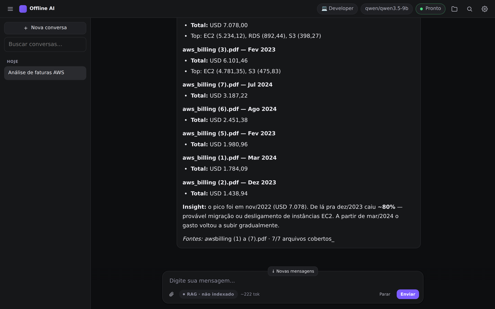
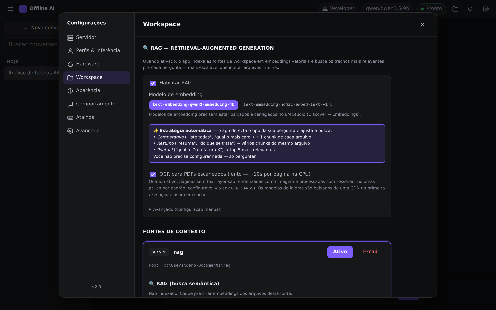
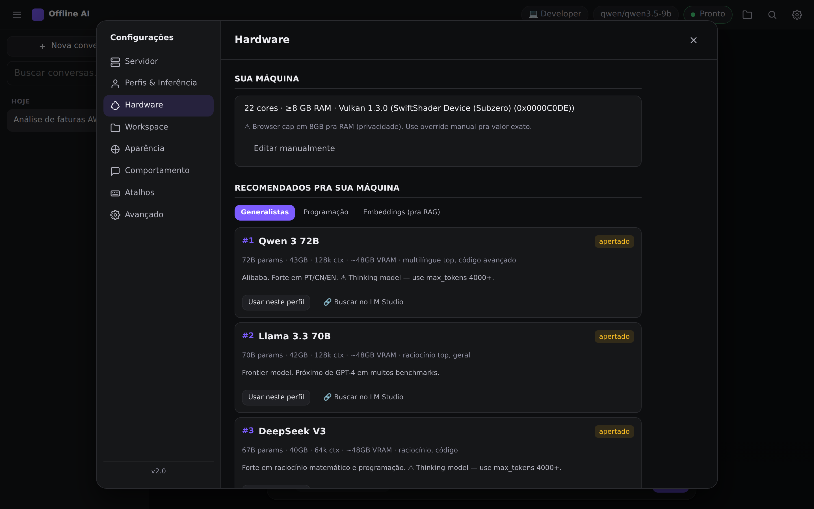

# Offline AI Chat

Self-hosted web client for [LM Studio](https://lmstudio.ai/) with **offline RAG**, **OCR for scanned PDFs**, and **multilingual embeddings** — all running on your own hardware.

[](LICENSE)
[](https://nodejs.org/)
[](https://docs.docker.com/compose/)
[](#stack)



> **Why?** Because you have an LLM running locally (gpt-oss, Qwen, DeepSeek, Gemma, Llama…) and the official LM Studio chat UI doesn't have RAG, OCR, custom profiles, multi-server switching, or the keyboard shortcuts you actually use. This is a tab in your browser that does.

📖 **Full user guide (PT-BR):** [`GUIDE.md`](./GUIDE.md) · **Dev notes:** [`CLAUDE.md`](./CLAUDE.md)

<details>
<summary><strong>More screenshots →</strong></summary>

**Workspace + RAG configuration** — connect a folder, pick an embedding model, toggle OCR, index. Auto-strategy figures out the rest.



**Hardware-aware model recommendations** — detects your VRAM/RAM and curates models from the catalog that actually fit.



</details>

---

## Features

- **RAG over local files** — index folders of PDFs / code / docs, ask questions, get answers grounded in *your* content. Auto-detects whether your query needs comparative coverage (lists, totals, ranking) or a pointed lookup, and adjusts retrieval accordingly.
- **OCR for scanned PDFs** — `tesseract.js` + `@napi-rs/canvas` fallback when a PDF has no text layer. Pages are rendered to PNG and OCR'd transparently. Multilingual (`por+eng` by default, configurable).
- **State-of-the-art embeddings** — defaults to `Qwen3-Embedding-4B` (top MTEB multilingual). Easy to switch from the UI.
- **Profiles, servers, sampling** — multiple LM Studio endpoints, per-profile system prompt + sampling parameters (`temperature`, `top_p`, `top_k`, `min_p`, `max_tokens`, etc.).
- **Reasoning model support** — surfaces chain-of-thought in a collapsible block, auto-bumps `max_tokens` if a thinking model exhausts the budget.
- **Cloud LLM integrations** — native support for [OpenRouter](https://openrouter.ai) to connect to cloud models (Gemini, Claude, DeepSeek, Llama...) with automatic grouping of free/paid models, pricing estimation, and proxy header forwarding.
- **Extensible Task Scheduler (Cron)** — schedule server-side tasks (such as daily web search digests, log rotations, or backups) to run in the background, even when the browser is closed.
- **LM Studio extended API** — load/unload models with custom context length straight from the Settings drawer.
- **Zero client-side dependencies** — vanilla JS modules, no build step. The server is a single Node proxy.
- **PWA** — installable, offline shell, service worker with network-first for JS modules.
- **Privacy by design** — nothing leaves your network unless configured. Conversations live in `localStorage` + `IndexedDB`.

---

## Quickstart

You need **Docker** (or Node 18+) and **LM Studio** with a model loaded and its OpenAI-compatible server running.

```bash
git clone https://github.com/pabstmp/offline-ai-chat.git
cd offline-ai-chat
docker compose up -d --build
```

Open <http://localhost:8080>.

The default Compose file publishes the app on `127.0.0.1:8080` only. That is intentional: LAN/company exposure needs authentication and filesystem whitelists.

### First-run setup

1. **Settings → Servidor**: Connect your model providers.
   - **LM Studio (Local)**: Point to your LM Studio base URL.
     - Native same machine: `http://localhost:1234/v1` (default).
     - Docker with LM Studio on the host: `http://host.docker.internal:1234/v1` (allowed by default).
     - LAN: `http://192.168.1.x:1234/v1` (replace `x`; add it to `ALLOWED_LM_HOSTS` if this app is LAN-exposed).
   - **OpenRouter (Cloud)**: Click **"+ Adicionar OpenRouter"** and paste your OpenRouter API key.
2. **Settings → Perfis & Inferência**: Pick a model from the dropdown. OpenRouter models will be grouped into 🎁 Free and 💰 Paid tiers with pricing estimates.
3. **(Optional) Settings → Workspace**: Connect a folder, click **Indexar com RAG**, and ask grounded questions.

### Without Docker

```bash
node server.js
# Open http://localhost:8080
```

> Don't open `index.html` directly via `file://` — the proxy at `/api/*` won't be there.

---

### LAN / company server

Use the assisted LAN flow. It asks for the LM Studio URL, shared workspace folder, app port, and login password, then writes `.env.lan` for you:

```bash
npm run lan:setup
npm run lan:up
npm run lan:logs
```

Then open `http://SERVER_IP:8080`, log in with the generated credentials, and set **Settings -> Servidor** to the LM Studio URL shown by the wizard.

Manual mode is still available with [`.env.lan.example`](./.env.lan.example) + [`docker-compose.lan.yml`](./docker-compose.lan.yml). For company use, keep the app behind your normal VPN/reverse proxy/SSO when possible.

---

## Configuration

All settings persist in `localStorage` (schema versioned). Soft migrations run on app boot — old configs are automatically upgraded when defaults improve (e.g. `max_tokens 4096 → 12000` for thinking models).

### Environment variables

See [`.env.example`](./.env.example). The most useful:

| Var | Default | Purpose |
|---|---|---|
| `HOST` | `127.0.0.1` native, `0.0.0.0` in Docker | Bind address |
| `PORT` | `8080` | HTTP port |
| `APP_AUTH_USER` | `offline-ai` | Username for built-in HTTP Basic auth |
| `APP_AUTH_PASSWORD` / `APP_AUTH_TOKEN` | _(empty)_ | Enables built-in auth when set |
| `WORKSPACE_ROOTS` | _(empty)_ | CSV of allowed absolute paths. Empty = local single-user only; blocked when exposed on LAN |
| `ALLOW_UNRESTRICTED_WORKSPACE` | auto | Explicit override for unrestricted filesystem mode |
| `ALLOWED_LM_HOSTS` | _(empty)_ | LM Studio proxy allowlist. Empty on LAN allows loopback only |
| `MAX_FILE_BYTES` | `262144` | Max text file read via `/api/fs/read` |
| `MAX_PDF_BYTES` | `33554432` | Max PDF size for extraction |
| `MAX_BODY_BYTES` | `~1.4x MAX_PDF_BYTES` | Max JSON request body, sized for base64 PDF uploads |
| `OCR_LANGS` | `por+eng` | Tesseract languages (e.g. `eng`, `por+eng+spa`) |
| `OCR_CACHE_DIR` | `/app/.cache/tesseract` | Where trained data files are cached |
| `CRON_ENABLED` | `false` | Enables background task scheduler/cron engine |
| `FS_WRITE_ROOTS` | _(empty)_ | CSV of allowed write-directories for cron tasks |
| `CRON_STATE_DIR` | `ROOT/data` | Where scheduled tasks and connection state is stored |
| `CRON_SEED_FILE` | _(empty)_ | JSON seed file path to pre-populate tasks/connections on boot |
| `CRON_TZ` | `UTC` | Default timezone for background tasks |

### Workspace whitelist (multi-user / LAN deploy)

Native local mode lets you connect any folder via the UI. When the server is bound to LAN (`HOST=0.0.0.0`, `::`, or another non-loopback address), `/api/fs/*` is blocked until `WORKSPACE_ROOTS` is set:

```yaml
# docker-compose.yml
environment:
  WORKSPACE_ROOTS: /workspace,/another-repo
volumes:
  - /path/to/your/project:/workspace:ro
```

Path traversal protection is always on regardless of this setting.

### Background Task Scheduler (Cron Engine)

The background scheduler (opt-in) executes automated tasks on the server independently of browser sessions (e.g., generating daily web search briefings/digests, rotating logs, or backing up state).

To enable it, set `CRON_ENABLED=true` and specify `FS_WRITE_ROOTS` to restrict write access for task outputs:

```bash
# Enable the background scheduler and allow outputs to be written to /app/data
CRON_ENABLED=true
FS_WRITE_ROOTS=/app/data
```

Once enabled, a new **Tasks (Agendamentos)** tab will appear under Settings in the UI where you can manage connection credentials (such as OpenRouter or LM Studio), schedule tasks using standard cron expressions, and inspect task execution history or results.

---

## Stack

- **Frontend:** Vanilla JS (ES modules), CSS tokens, zero dependencies
- **Backend:** Node 18+ (`http`, `fs`, `crypto`) + `pdfjs-dist` + `tesseract.js` + `@napi-rs/canvas`
- **Storage:** `localStorage` + `IndexedDB` (vector store for RAG embeddings)
- **Deploy:** Docker Compose or native Node

The server is a thin proxy: it forwards `/api/chat/completions`, `/api/embeddings`, `/api/models` to your LM Studio (handling SSE streaming), and exposes `/api/fs/*` for the filesystem-based RAG. It does PDF text extraction (layout-aware) and falls back to OCR when no text layer is present.

---

## Keyboard shortcuts (defaults)

| Action | Shortcut |
|---|---|
| Send | Enter |
| New line | Shift+Enter |
| New chat | Ctrl+N |
| Toggle history | Ctrl+B |
| Settings | Ctrl+, |
| Command palette | Ctrl+K |
| Focus composer | Ctrl+L |
| Stop generation | Esc |
| Next profile | Ctrl+Shift+P |
| Zen mode | Ctrl+\\ |
| Quick-open file | Ctrl+P |
| Toggle workspace | Ctrl+Shift+E |

All remappable in **Settings → Atalhos**.

---

## Privacy

- Nothing is sent to the cloud. The proxy only talks to your LM Studio.
- Conversations and settings live in your browser's `localStorage` / `IndexedDB`.
- The OCR language packs (~17 MB) are downloaded from the tesseract.js CDN on first use, then cached locally. After that, fully offline.
- Filesystem read endpoints (`/api/fs/*`) honor your OS permissions, are sandboxed against path traversal/symlink escape, and require `WORKSPACE_ROOTS` when the app is exposed on LAN.
- The built-in Basic auth is suitable for small LAN deployments; for company use, put it behind your normal reverse proxy/VPN/SSO as well.

---

## Troubleshooting

**App loads but won't connect to LM Studio.**

```bash
curl http://localhost:1234/v1/models
```

If that fails: LM Studio's server isn't running, model isn't loaded, or you're hitting the wrong host/port. Replace `localhost` with the IP of the machine running LM Studio if it's on another box.

**Reasoning model returns empty content.** It exhausted `max_tokens` in its `<think>` block. The app auto-fixes this on the first occurrence — just resubmit the question. If it keeps happening, the bottleneck is **LM Studio's `n_ctx`** (loaded context length), not `max_tokens`. Use **Settings → Servidor** to load the model with a larger context.

**RAG drops files.** Comparative queries should cover all indexed files automatically. If your debug log (`Settings → Avançado → Modo debug`) shows `covering 5/7 files`, your charBudget can't fit the whole corpus and similarity-based fallback kicks in. Either re-index with smaller chunks (`Settings → Workspace → RAG → Avançado`) or load LM Studio with a larger `n_ctx`.

For deeper troubleshooting and the full feature reference, see [`GUIDE.md`](./GUIDE.md).

---

## Contributing

PRs welcome. See [`CONTRIBUTING.md`](./CONTRIBUTING.md). For security issues, see [`SECURITY.md`](./SECURITY.md).

---

## License

MIT — see [`LICENSE`](./LICENSE).

Builds on [`pdfjs-dist`](https://mozilla.github.io/pdf.js/) (Apache 2.0), [`tesseract.js`](https://tesseract.projectnaptha.com/) (Apache 2.0), and [`@napi-rs/canvas`](https://github.com/Brooooooklyn/canvas) (MIT).
